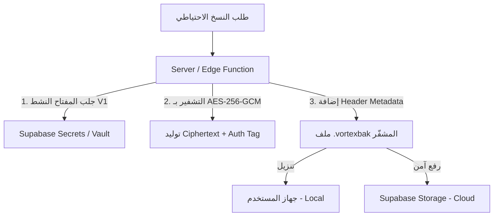
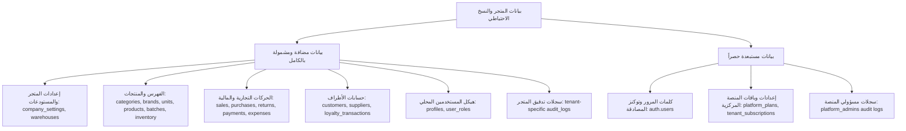
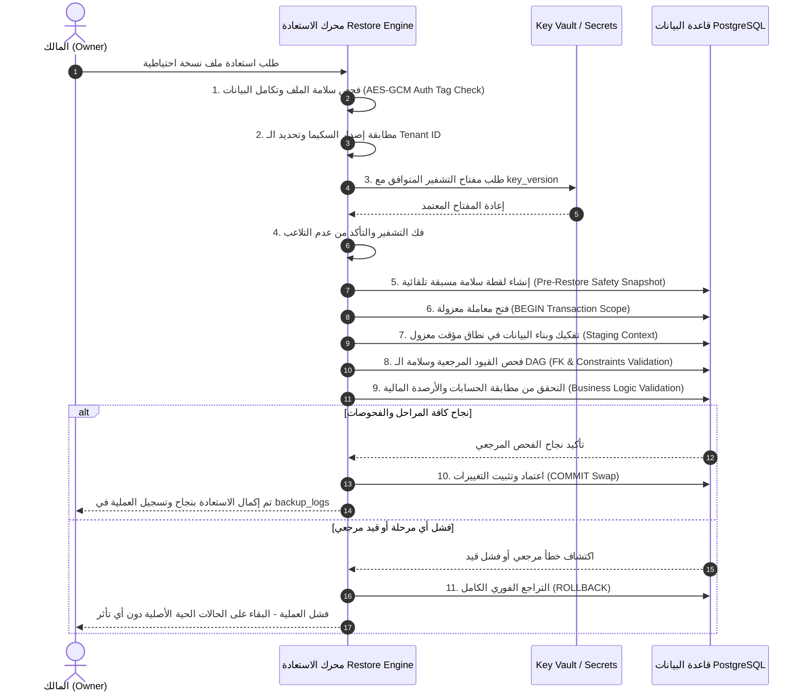
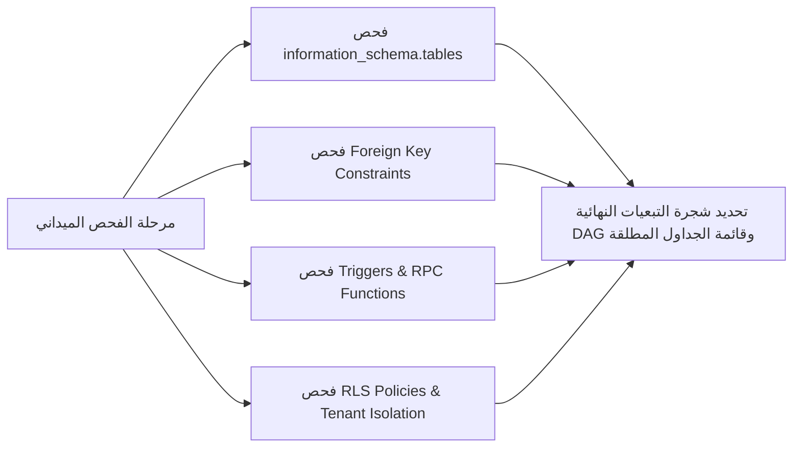

# خطة إعداد ونظام النسخ الاحتياطي والمزامنة الآمنة — فورتيكس ERP (Market Hub)

> **إخلاء مسؤولية وتننويه:** هذه الوثيقة مخصصة للتخطيط والتصميم الهيكلي الفني فقط. لم يتم إجراء أي تعديل على قاعدة البيانات، أو الكود البرمجي، أو الإعدادات الحالية، أو الخطط، أو سياسات RLS أثناء إعداد هذه الخطة.

---

## 1. الهدف من نظام النسخ الاحتياطي ونوع الاستعادة (System Goals & Restore Type)

يقوم نظام النسخ الاحتياطي في منصة **Market Hub / Vortex ERP** على تحقيق الأهداف التالية:

1. **الاستعادة القائمة على الللقطات الزمانية (Snapshot Backup / Snapshot Restore):**
   - يعتمد النظام على مفهوم **اللقطات الزمانية (Snapshots)**، حيث تُحفظ حالة البيانات كاملة في نقطة زمنية محددة (`Created At`).
   - الاستعادة تعني إعادة المتجر إلى حالة اللقطة المحددة بدقة دون الادعاء بأن النظام يملك Point-in-Time Recovery (PITR) مستمر على مستوى الأجزاء من الثانية.
   - **ملاحظة مستقبلية:** يُترك مفهوم الـ Continuous Point-in-Time Recovery (WAL-based PITR) كإمكانية بنية تحتية سحابية مستقلة مستقبلاً (Infrastructure Add-on) خارج نطاق التطبيق الحالي.
2. **حماية البيانات التشغيلية والمالية:** التصدير والاسترجاع الآمن دون إتلاف التكامل المرجعي للجداول.
3. **التخزين المزدوج:** توفير خياري التخزين المحلي (Local Snapshot Download) والسحابي المؤتمت (Cloud Snapshot on Supabase Storage).
4. **عزل البيانات والأمان الصارم:** حماية بيانات كل متجر (`tenant_id`) وتعديل عمليات الاستعادة بضوابط صارمة.

---

## 2. أنواع النسخ الاحتياطي (Backup Types)

| ميزة المقارنة | النسخة الاحتياطية المحلية (Local Snapshot) | النسخة الاحتياطية السحابية (Cloud Snapshot) |
| :--- | :--- | :--- |
| **مكان الحفظ** | جهاز المستخدم (الملفات المحلية / التنزيلات) | Supabase Storage Bucket المخصص للشركة |
| **درجة الأوتوماتيكية** | تنزل بطلب يدوّي أو حفظ عبر المتصفح | آلية بالكامل وفق جدول محدد (يومي/أسبوعي) |
| **الاعتمادية** | تعتمد على وجود الجهاز المحلي وتأمين المستخدم له | مستقلة تماماً وتعمل في الخلفية السحابية (24/7) |
| **طريقة التشفير** | تشفير Server-Side / Edge-Side قبل التنزيل (`.vortexbak`) | تشفير AES-256-GCM قبل الرفع إلى الـ Bucket |
| **طريقة الاستعادة** | رفع الملف المشفّر من جهاز المستخدم إلى الواجهة | اختيار النسخة السحابية المحددة من القائمة مباشرة |
| **الاستخدام الأمثل** | الاحتفاظ بنسخة فورية سرية في يد المالك قبل إجراء تغييرات | الحماية المستمرة ضد الكوارث والأخطاء دون تدخل يدوي |

---

## 3. البيانات الوصفية للنسخة الاحتياطية (Backup Metadata Schema)

تحتوي كل نسخة احتياطية على ترويسة بيانات وصفية (Header Metadata) غير مشفّرة تقرأها آليات النظام قبل بدء فك تشفير المحتوى الرئيسي:

```json
{
  "backup_id": "bak_987f6543-e21b-12d3-a456-426614174000",
  "tenant_id": "tenant_123456",
  "schema_version": "2026.09.28.1",
  "engine_version": "v1.0.0",
  "key_version": "v1",
  "created_at": "2026-09-28T03:00:00Z",
  "backup_type": "auto_scheduled",
  "storage_type": "cloud",
  "file_size_bytes": 4521984,
  "auth_tag": "e3b0c44298fc1c149afbf4c8996fb924",
  "checksum_sha256": "8f4e3c2a1b0d...",
  "status": "completed",
  "tables_summary": {
    "products": 450,
    "sales_invoices": 1280,
    "customers": 210
  }
}
```

---

## 4. التشفير وإدارة المفاتيح (Encryption & Key Management Architecture)

### 1. معيار التشفير المقترح (AES-256-GCM)
* التشفير يتم بواسطة **AES-256-GCM** (Galois/Counter Mode)، وهو نظام تشفير مشفوع بالتوثيق (AEAD - Authenticated Encryption with Associated Data).
* يوفر AES-256-GCM تشفيراً للبيانات مع توليد **Authentication Tag (Auth Tag)** بسعة 128-bit يضمن كشف أي تلاعب بالملف تلقائياً.

### 2. سلامة البيانات (AES-GCM vs HMAC)
* **AES-256-GCM كافٍ بمفرده** للتحقق من سلامة وصحة الملف المشفّر دون الحاجة لإضافة HMAC-SHA256 إضافي فوق المحتوى المشفّر؛ لأن GCM يضم ميزة التوثيق الرقمي المدمج (AEAD).
* تُستخدم الـ Auth Tag والـ SHA256 Checksum المرفقة بالترويسة للتحقق المبدئي والسرعة قبل فك التشفير.

### 3. إدارة المفاتيح وإصداراتها (Key Management & Key Versioning)
* **مكان التشفير وحفظ المفاتيح:**
  - يتم التشفير وفك التشفير حصراً في جانب الخادم (Server-Side via Supabase Edge Functions / Vault).
  - **حظر المفاتيح على الواجهة:** يُمنع حظراً باتاً وضع مفاتيح التشفير داخل كود الـ Frontend أو داخل ملف النسخة الاحتياطية بنص صريح.
* **إدارة إصدارات المفاتيح (Key Versioning Strategy):**
  - تُخزن المفاتيح داخل **Supabase Vault / Environment Secrets** بأسماء محددة الإصدار (مثل `BACKUP_KEY_V1`, `BACKUP_KEY_V2`).
  - يُسجّل رقم إصدار المفتاح (`key_version: "v1"`) في ترويسة الـ Metadata للنسخة الاحتياطية.
  - عند تدوير المفاتيح (Key Rotation) إلى `v2` مستقبلاً، يحتفظ النظام بالمفاتيح القديمة في Vault بشكل آمن. عند طلب استعادة نسخة قديمة، يقرأ المحرك `key_version` من الـ Metadata ويطلب المفتاح المناسب فك تشفيره من الخادم.



---

## 5. نطاق البيانات المشمولة وسجلات التدقيق (Backup Data Boundaries & Audit Logs)

راجعنا قرار استبعاد `audit_logs` ليكون أكثر دقة وتوازناً:



### 1. بيانات مشمولة في النسخة (Included Data):
* **إعدادات ومستودعات المتجر:** `company_settings`, `warehouses`.
* **الفهرس والمنتجات والمخزون:** `categories`, `brands`, `units`, `products`, `product_batches`, `inventory`.
* **الحسابات والذمم والأطراف:** `customers`, `suppliers`, `customer_payments`, `customer_payment_splits`, `loyalty_transactions`.
* **المبيعات والمشتريات والمرتجعات والمصروفات:** `sales_invoices`, `sales_invoice_items`, `sales_returns`, `sales_return_items`, `purchase_invoices`, `purchase_invoice_items`, `purchase_returns`, `purchase_return_items`, `stock_movements`, `stock_transfers`, `stock_transfer_items`, `expenses`, `expense_categories`.
* **الهيكل الإداري الداخلي وسجلات المتجر:** `profiles`, `user_roles` بالإضافة إلى **`audit_logs` الخاصة بالـ Tenant** للحفاظ على السجل التشغيلي والتاريخي للمتجر.

### 2. بيانات مستبعدة حصراً (Excluded Data):
* **بيانات المصادقة الحساسة (`auth.users`):** حماية أمنية ومنع تسريب التجزئات الرمزية.
* **بيانات باقات واشتراكات المنصة (`platform_plans`, `tenant_subscriptions`, `platform_modules`):** تُدار مركزياً لحظر التلاعب بالباقات.
* **سجلات التدقيق الخاصة بإدارة المنصة المركزية (Platform Superadmin Audit Logs):** لعدم شمول بيانات لا تخص المتجر.

---

## 6. المعمارية الآمنة للاستعادة (Secure Restore Architecture & Pipeline)

أُعيد تصميم الاستعادة لتجنب الاعتماد المباشر على سيناريو `DELETE -> INSERT` غير الآمن. يعتمد النظام خطة الاستعادة المرحلية المتكاملة (Multi-Stage Isolated Restore Pipeline):



### المراحل الـ 9 لمعمارية الاستعادة الآمنة:
1. **المرحلة 1: التحقق التكاملي من الملف (Validate File & Integrity):** فحص الترويسة و Auth Tag والـ Checksum والتأكد من سلامة الملف قبل أي معالجة.
2. **المرحلة 2: التحقق من التوافقية (Verify Schema Compatibility):** التأكد من مطابقة `schema_version` لإصدار قاعدة البيانات الحالي.
3. **المرحلة 3: التوثيق والتأكيد (Authorization & Authentication):** التأكد من دور المالك (`owner`) وإعادة طلب كلمة المرور / OTP.
4. **المرحلة 4: لقطة السلامة المسبقة (Pre-Restore Safety Snapshot):** أخذ نسخة سحابية مؤقتة فورية للوضع الحالي قبل البدء بالتعديل.
5. **المرحلة 5: الاستعادة المعزولة (Isolated Staging Restore):** تنفيذ العملية داخل نطاق معاملة مالية معزولة (`BEGIN Transaction`).
6. **المرحلة 6: فحص القيود والعلاقات (Validate Foreign Keys & Constraints):** فحص شجرة التبعيات المرجعية (Product -> Inventory -> Sales -> Payments) والتأكد من عدم وجود أيتام (Orphans).
7. **المرحلة 7: فحص مطابقة منطق الأعمال (Validate Business Data Integrity):** التأكد من أن مجموع حركة الفواتير والذمم يطابق أرصدة العملاء والموردين.
8. **المرحلة 8: التثبيت المحكوم (Controlled Commit / Swap):** اعتماد التغييرات رسمياً بـ `COMMIT` في حال نجاح كل الفحوصات.
9. **المرحلة 9: التعامل مع الفشل (Failure Handling & Abort):** في حال إخفاق أي مرحلة، يُنفّذ `ROLLBACK` فوري وتُترك قاعدة البيانات الحية كما هي دون أي مساس بها، مع تسجيل سبب الفشل في `backup_logs`.

---

## 7. مرحلة فحص قاعدة البيانات الميداني الإلزامي (Mandatory Schema Discovery Phase)

قبل البدء بالبرمجة أو إنشاء المكونات، يُفرض على المطور تنفيذ **مرحلة الفحص الميداني لقاعدة البيانات (Schema Discovery Phase)**:



### خطوات الفحص الميداني:
1. استخراج القائمة الكاملة للجداول الفعلية وقواعد البيانات المحدثة.
2. رسم شجرة التبعيات المرجعية (Directed Acyclic Graph - DAG) للجداول لترتيب عملية التصدير والاستعادة.
3. مراجعة محفزات التحديث التلقائي (`Triggers`) مثل تحديث المخزون أو الأرصدة لمنع تكرار الحركات أثناء الاستعادة.
4. التأكد من عدم نسيان أي جدول أو علاقة ضرورية لسلامة البيانات.

---

## 8. الربط الديناميكي مع نظام الخطط والاشتراكات (Dynamic Plans & Subscriptions)

لا تفترض الخطة تقسيماً ثابتاً غير قابل للتغيير، بل تُصمم لتقرأ نظام الباقات الحية في المشروع:

1. **الربط الديناميكي:** يقرأ محرك النسخ الاحتياطي بيانات الباقة الحالية من جدول `tenant_subscriptions` والخيارات المعرفة في `platform_plans`.
2. **التحقق من الميزات (Capability Checks):**
   - يفحص المحرك صلاحيات المتجر (مثل: `backup_cloud_enabled`, `backup_auto_schedule`, `max_retention_copies`).
3. **عدم تعديل الباقات الحالية:** لن يتم إضافة أو تعديل أي باقة حالية في جدول `platform_plans` كجزء من هذا المشروع إلا بموافقة مسبقة ومستقلة.

---

## 9. الأمان وعزل المتاجر كعمود فقري (Tenant Isolation & Security Pillars)

تُعتبر ضوابط الأمان جزءاً من المعمارية الأساسية للنسخ الاحتياطي وليست مجرد واجهات:

1. **عزل المتاجر (Tenant Isolation):** قيد كافة عمليات الاستخراج بـ `tenant_id` المطابق لمستخدم الجلسة المؤكد.
2. **سياسات Row Level Security (RLS):** تطبيق RLS على جداول البيانات والـ Storage Bucket لمنع قراءة أو تحميل نسخة متجر آخر تحت أي ظرف.
3. **التأكد من أمان الملفات:** تشفير الملفات وصيانتها باستمرار ضد الوصول غير المصرح به.

---

## 10. التحقق المستفيض من سلامة النسخة (Backup Integrity Checklist)

قبل السماح بأي عملية استعادة، يجب أن تنال النسخة الاحتياطية موافقة الفحوصات التالية:

- [x] **الاكتمال (Completeness):** احتواء الملف على كافة الجداول المحددة في ترويسة الـ Metadata.
- [x] **السلامة الفنية (Non-corruption):** اجتياز فحص AES-256-GCM Auth Tag ومطابقة Checksum.
- [x] **الهوية والتأكد من المتجر (Ownership Check):** مطابقة `tenant_id` الموجود بالنسخة مع المتجر الحالي.
- [x] **التوافقية (Schema Compatibility):** دعم `schema_version` ومطابقتها للسكيما الحالية.
- [x] **منع التلاعب (Tamper Proof):** التحقق من سلامة التوقيع وعدم التعديل اليدوي.
- [x] **قابليتها للاستعادة (Restorability Dry-run):** فحص التبعيات المرجعية داخل المعاملة المؤقتة قبل التثبيت.

---

## 11. الجدولة التلقائية التناغمية (Background Scheduling Architecture)

تنفيذ النسخ المجدول بدون الحاجة لبقاء متصفح المستخدم مفتوحاً:

* **Supabase Edge Function (`scheduled-backup`):** تعمل في الخلفية عبر بيئة خادمة مستقلة.
* **مُشغّل الجدولة (Cron Trigger):** ربط الـ Edge Function بواسطة `pg_cron` أو مُشغّل جدولة سحابي لتنفيذ النسخ المجدول للمشتركين المستحقين بحسب باقاتهم في أوقات الخمول.

---

## 12. خريطة التنفيذ المحدثة (Updated Implementation Roadmap)

عند الموافقة، سينتقل التنفيذ عبر المراحل التالية:

1. **المرحلة 0:** الفحص الميداني لقواعد البيانات والشفرة المرجعية (Schema Discovery).
2. **المرحلة 1:** إنشاء جدول `backup_logs` و Bucket التخزين وتكوين سياسات RLS.
3. **المرحلة 2:** تطوير محرك التشفير AES-256-GCM والتصدير وإدارة ترويسة Metadata.
4. **المرحلة 3:** برمجة Edge Function وتفعيل الجدولة السحابية.
5. **المرحلة 4:** بناء محرك الاستعادة المرحلي المعزول (Multi-Stage Isolated Restore Pipeline).
6. **المرحلة 5:** تطوير وتكامل واجهة الإعدادات (`BackupSettingsCard`).
7. **المرحلة 6:** الاختبارات الشاملة والفحوصات التأكيدية.

---

## 13. خريطة الملفات والمكونات المتوقع تعديلها مستقبلاً (Expected Files Roadmap)

> **تنبيه حازم:** الملفات أدناه هي الملفات المتوقع التعامل معها لاحقاً **بعد الموافقة على الخطة**، ولم يتم تعديلها أو إضافتها في هذه المرحلة:

### ملفات متوقع إنشاؤها لاحقاً (New Files):
- `supabase/migrations/20260929000000_backup_system_tables.sql`
- `supabase/functions/scheduled-backup/index.ts`
- `src/components/backup-settings-card.tsx`
- `src/components/backup-restore-dialog.tsx`
- `src/lib/backup/backup-engine.ts`
- `src/lib/backup/crypto-utils.ts`

### ملفات متوقع تعديلها لاحقاً (Files to Update):
- [`src/routes/_app.settings.tsx`](file:///c:/Users/ahmed/Desktop/market-hub/src/routes/_app.settings.tsx)
- [`src/integrations/supabase/types.ts`](file:///c:/Users/ahmed/Desktop/market-hub/src/integrations/supabase/types.ts)
