<div align="center">


# Vortex ERP

**Grocery & Wholesale Trading Platform**


</div>

> **Hero view — Operations dashboard**
>
> [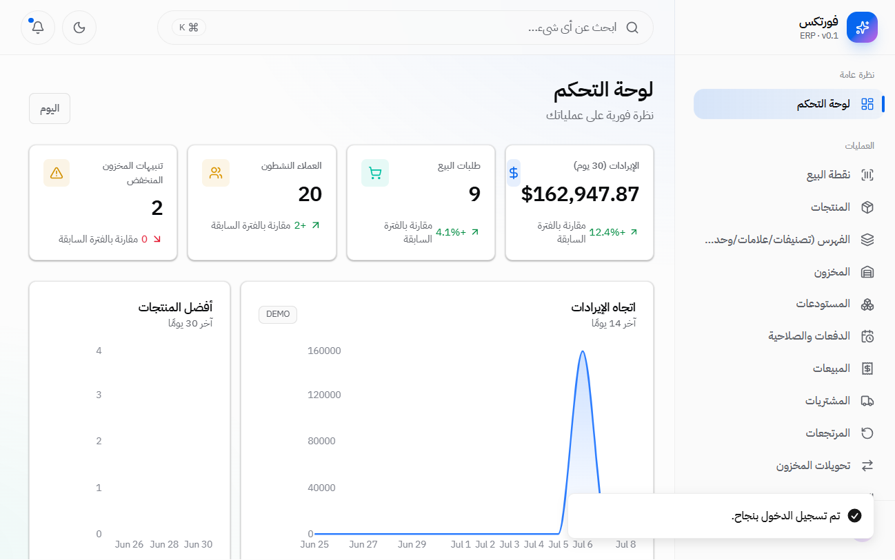](screenshots/002-dashboard.png)
>
> A single operational view for revenue, sales activity, low-stock signals, and product performance.

---

## Table of Contents | فهرس المحتويات

- [Overview](#overview--نظرة-عامة)
- [Quick Start](#quick-start--بدء-سريع)
- [Why This Project?](#why-this-project--لماذا-هذا-المشروع)
- [System Scope](#system-scope--نطاق-النظام)
- [Screenshots](#screenshots--لقطات-الشاشة)
- [Key Features](#key-features--الميزات-الرئيسية)
- [Module Overview](#module-overview--نظرة-عامة-على-الوحدات)
- [Architecture Overview](#architecture-overview--نظرة-عامة-على-المعمارية)
- [Technology Stack](#technology-stack)
- [Installation & Configuration](#installation--configuration--التثبيت-والإعداد)
- [API Overview](#api-overview)
- [Database Overview](#database-overview)
- [Security](#security--الأمان)
- [Deployment](#deployment--النشر)
- [Roadmap](#roadmap--خارطة-الطريق)
- [Development Team](#development-team)

## Overview | نظرة عامة

🇺🇸 **English**

Vortex ERP is an operational system for grocery, wholesale, and retail trading. It brings point-of-sale transactions, purchases, inventory, warehouses, finance, and customer operations into one workspace. The application is built for teams that need controlled daily workflows and a dependable view of commercial data without moving between disconnected tools.

🇸🇦 **العربية**

فورتكس ERP نظام تشغيلي لإدارة تجارة البقالة والجملة والتجزئة. يوحّد عمليات نقطة البيع والمشتريات والمخزون والمستودعات والمالية وإدارة العملاء في مساحة عمل واحدة. صُمّم للفرق التي تحتاج إلى تنفيذ عملياتها اليومية بصلاحيات مضبوطة ورؤية موثوقة للبيانات التجارية دون التنقل بين أدوات منفصلة.

## Quick Start | بدء سريع

🇺🇸 **English**

The repository is configured for npm scripts and requires a Supabase project configuration before the application can connect to its data layer.

🇸🇦 **العربية**

يستخدم المستودع أوامر npm ويتطلب إعداد مشروع Supabase قبل أن يتمكن التطبيق من الاتصال بطبقة البيانات.

```bash
git clone https://github.com/mosaa65/market-hub.git
cd market-hub
npm install
# Configure `.env` as described below before starting the application.
npm run dev
```

Configure the required environment variables before starting the development server; the detailed configuration is documented in [Installation & Configuration](#installation--configuration--التثبيت-والإعداد).

## Quick Facts | حقائق سريعة

| Item | Value |
| --- | --- |
| Project type | Web-based ERP for grocery, wholesale, and retail operations |
| Architecture | Modular TanStack Start application with Supabase-backed PostgreSQL RPC and RLS |
| Frontend | React, TypeScript, TanStack Start, TanStack Router, Tailwind CSS |
| Backend | TanStack Start server runtime, Supabase Auth, and PostgreSQL RPC functions |
| Database | PostgreSQL via Supabase |
| Deployment | [Vercel — live preview](https://market-hub-two-theta.vercel.app/) |
| License | Not specified in the repository |

---

## Why This Project? | لماذا هذا المشروع؟

🇺🇸 **English**

Trading operations are tightly coupled: a sale affects invoice history, stock availability, customer balances, and management reporting. Vortex ERP puts those workflows into a single role-aware system, reducing the operational gap between a counter sale, warehouse activity, finance follow-up, and reporting.

🇸🇦 **العربية**

عمليات التجارة مترابطة؛ فالبيع يؤثر في الفواتير وتوفر المخزون وأرصدة العملاء والتقارير الإدارية. يجمع فورتكس ERP هذه المسارات في نظام واحد يراعي الصلاحيات، مما يقلل الفجوة التشغيلية بين البيع عند نقطة البيع وحركة المستودعات والمتابعة المالية والتقارير.

## System Scope | نطاق النظام

🇺🇸 **English**

- **Commerce:** POS, sales invoices, purchases, sales returns, purchase returns, and stock transfers.
- **Inventory:** products, categories, brands, units, warehouses, stock movements, low-stock signals, batches, and expiry tracking.
- **Relationships:** customers, suppliers, credit limits, balances, collections, and customer loyalty points.
- **Finance and insight:** expenses, receivables, payables, dashboards, analytics, reports, CSV exports, and printable documents.
- **Administration:** authentication, roles, company settings, notifications, audit-log review, themes, and bilingual RTL/LTR presentation.

🇸🇦 **العربية**

- **التجارة:** نقطة البيع وفواتير المبيعات والمشتريات ومرتجعات البيع والشراء وتحويلات المخزون.
- **المخزون:** المنتجات والتصنيفات والعلامات والوحدات والمستودعات وحركات المخزون والتنبيهات والدفعات وتواريخ الصلاحية.
- **العلاقات:** العملاء والموردون والحدود الائتمانية والأرصدة والتحصيلات ونقاط الولاء.
- **المالية والرؤية:** المصروفات والذمم ولوحات المتابعة والتحليلات والتقارير وتصدير CSV والمستندات القابلة للطباعة.
- **الإدارة:** المصادقة والأدوار وإعدادات الشركة والإشعارات ومراجعة سجل الأحداث والسمات ودعم العربية والإنجليزية مع RTL/LTR.

---

## Screenshots | لقطات الشاشة

🇺🇸 **English**

Select any image to view it at full size. The verified UI captures live in `screenshots/`; the complete set is indexed in [screenshots/index.txt](screenshots/index.txt).

🇸🇦 **العربية**

اضغط على أي صورة لعرضها بالحجم الكامل. توجد لقطات الواجهة الموثقة في `screenshots/`، وتتوفر القائمة الكاملة في [screenshots/index.txt](screenshots/index.txt).

### Authentication | المصادقة

[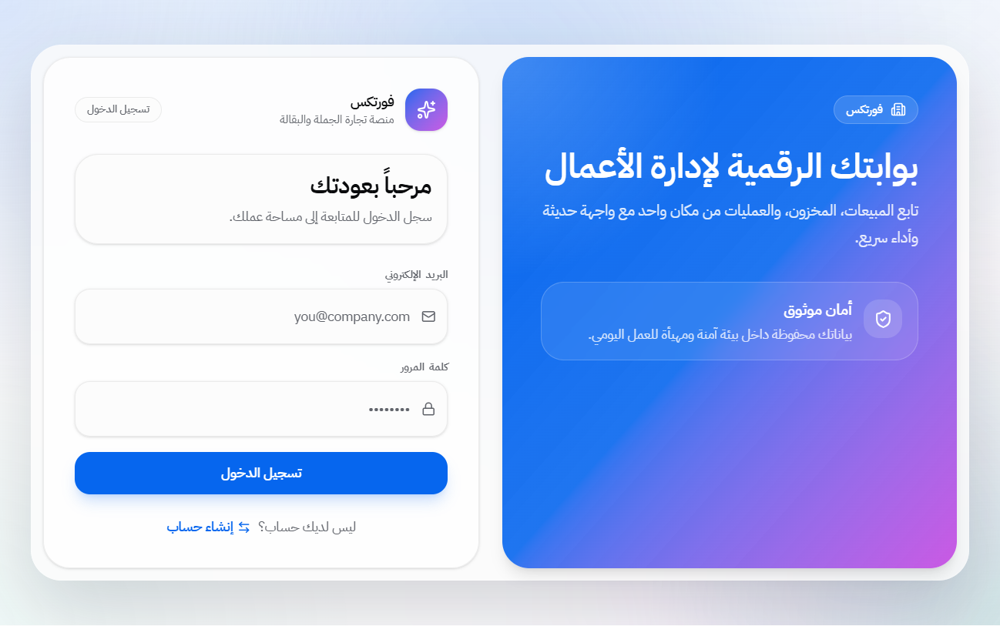](screenshots/001-login.png)

<sub>Authentication — Arabic and English access flow</sub>

### Commerce | التجارة

| Point of sale | Sales |
| --- | --- |
| [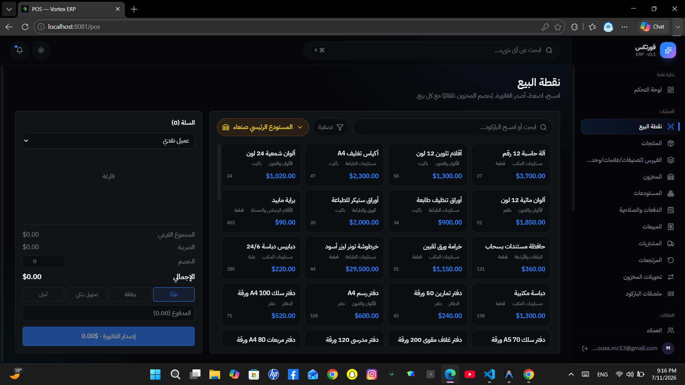](screenshots/003-pos.png)<br><sub>Commerce — checkout workspace</sub> | [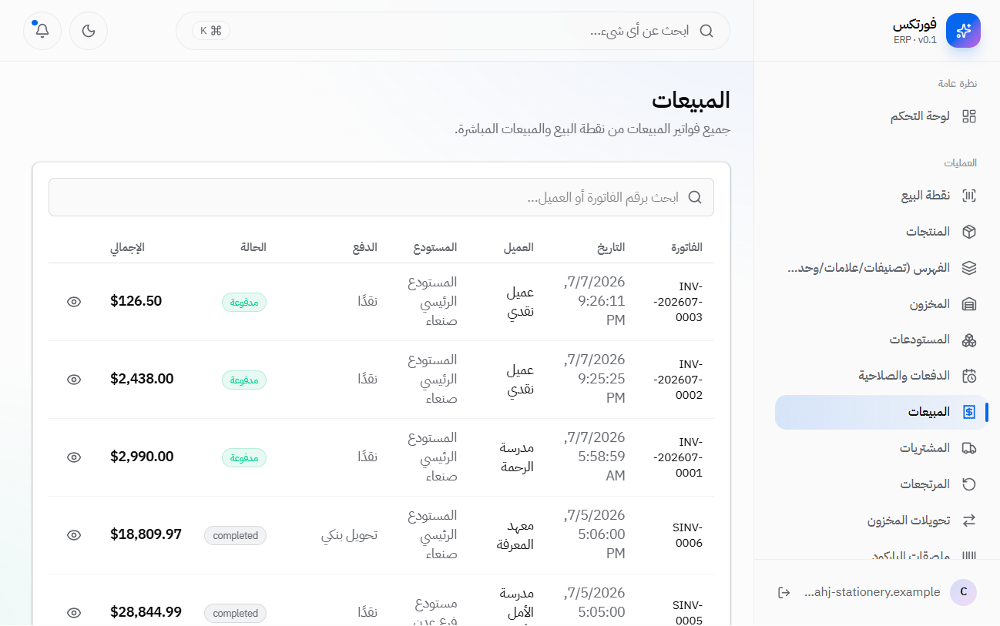](screenshots/032-sales.png)<br><sub>Commerce — sales-invoice review</sub> |

| Purchases | Returns |
| --- | --- |
| [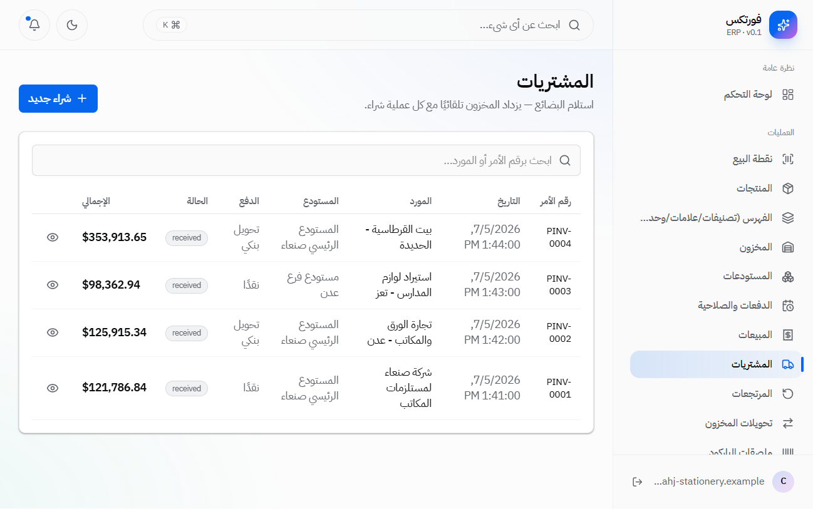](screenshots/030-purchases.png)<br><sub>Commerce — goods receiving</sub> | [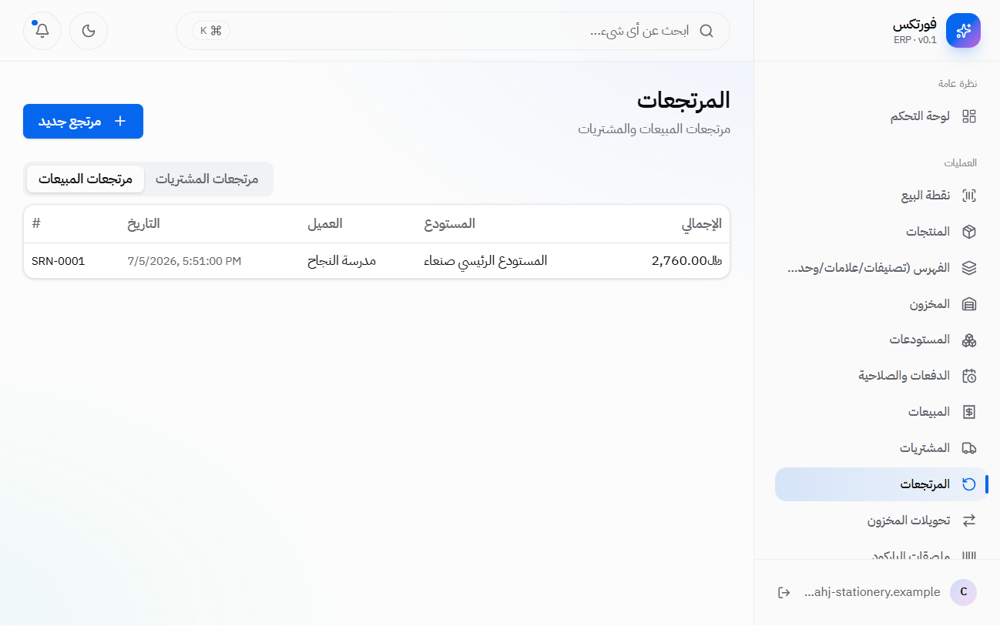](screenshots/048-returns.png)<br><sub>Commerce — sales and purchase returns</sub> |

### Catalog and Inventory | الفهرس والمخزون

| Products | Inventory | Barcode labels |
| --- | --- | --- |
| [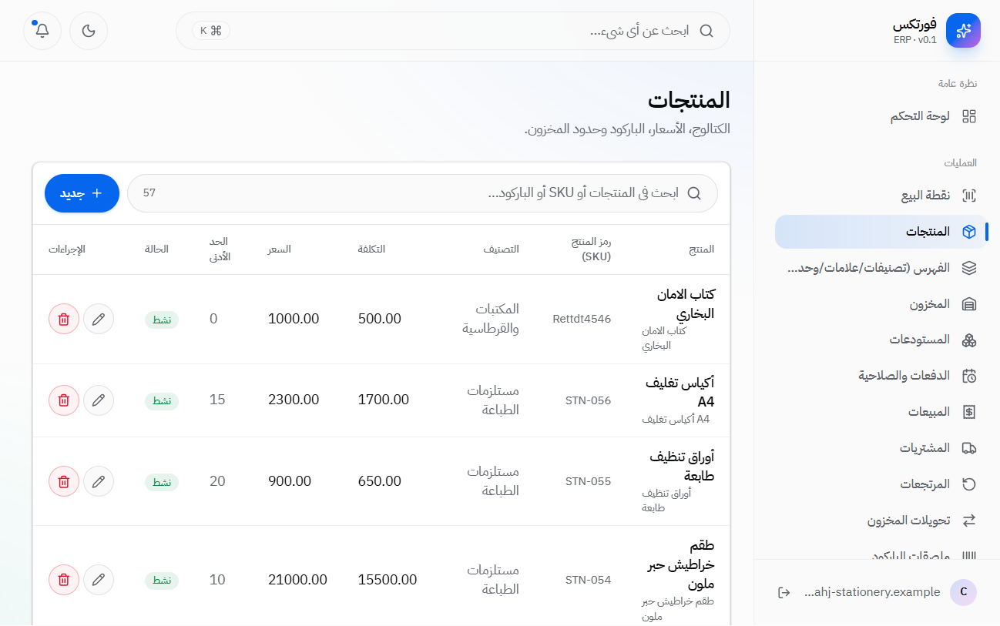](screenshots/005-products.png)<br><sub>Catalog — products, pricing, and identifiers</sub> | [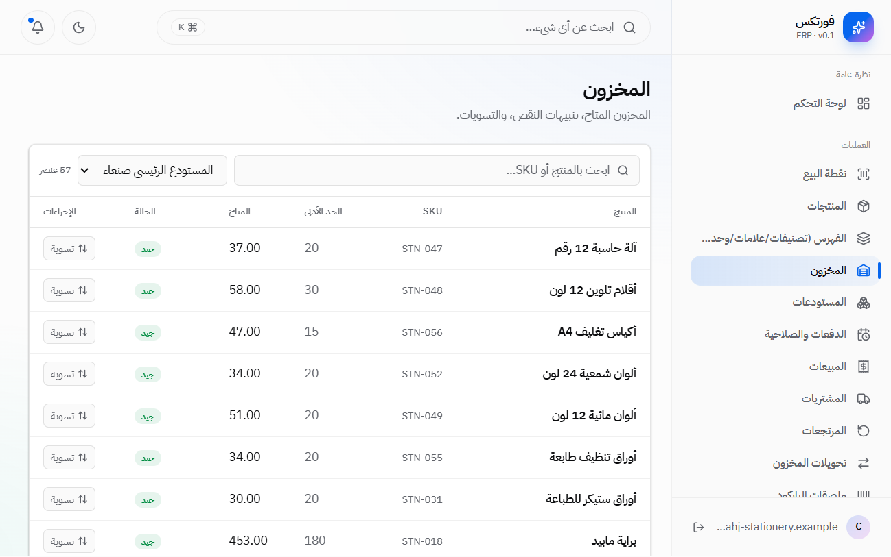](screenshots/024-inventory.png)<br><sub>Inventory — stock on hand and adjustments</sub> | [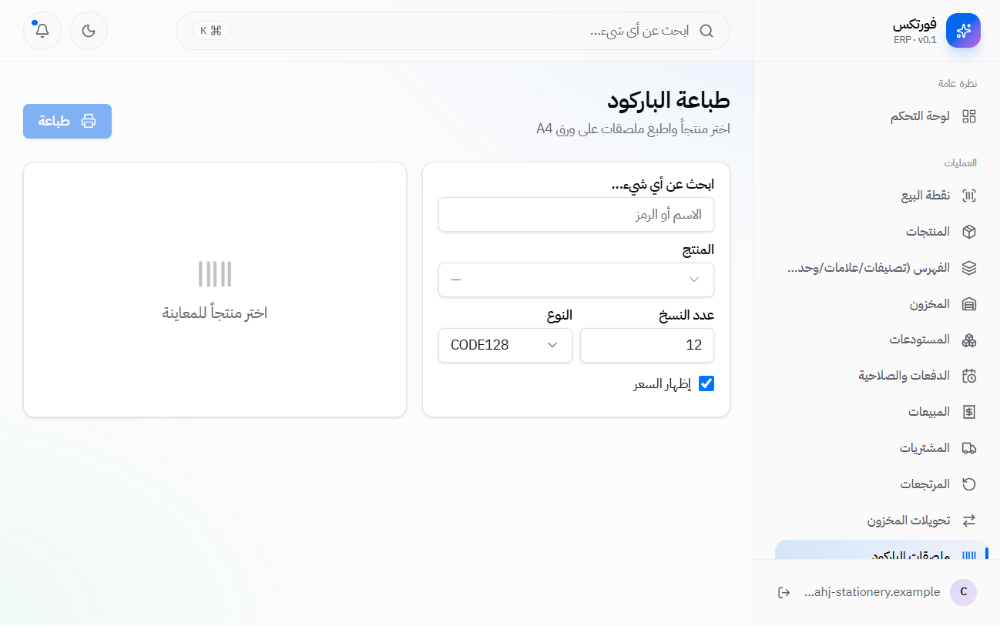](screenshots/049-barcodes.png)<br><sub>Catalog — barcode generation and printing</sub> |

### Finance and Insight | المالية والرؤى

| Finance | Loyalty |
| --- | --- |
| [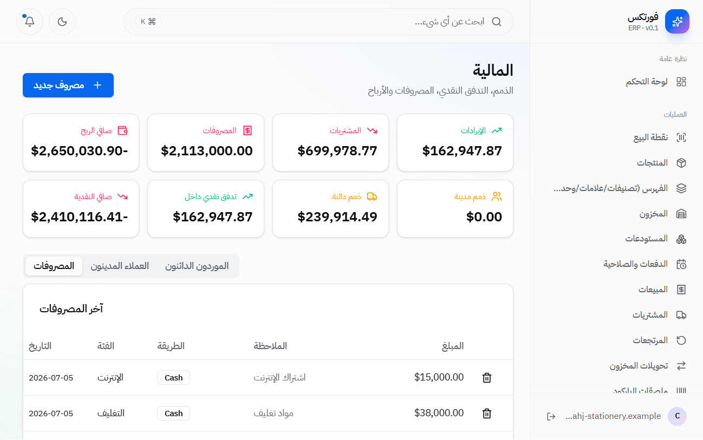](screenshots/035-finance.png)<br><sub>Finance — expenses and balances</sub> | [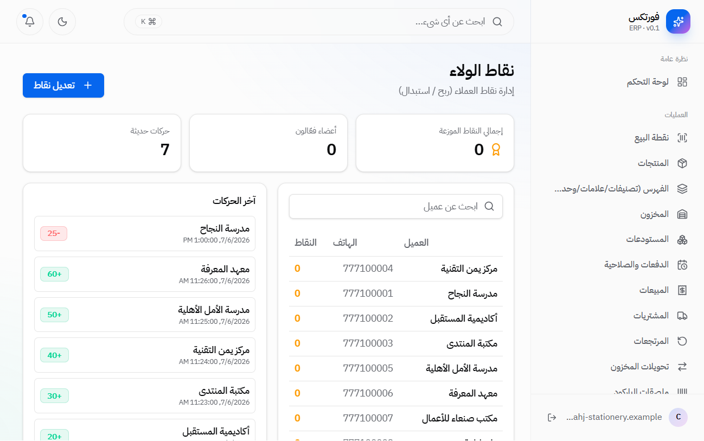](screenshots/041-loyalty.png)<br><sub>Customers — loyalty administration</sub> |

| Advanced analytics | Reports |
| --- | --- |
| [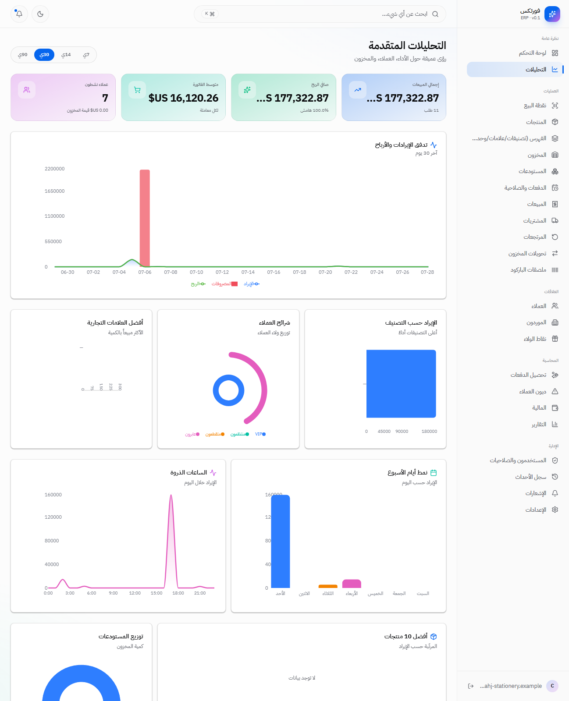](screenshots/052-analytics.png)<br><sub>Insight — revenue, profit, product, category, and warehouse analysis</sub> | [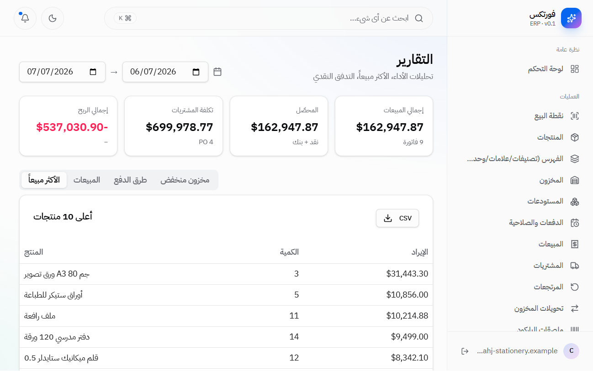](screenshots/043-reports.png)<br><sub>Insight — operational reporting</sub> |

### Administration | الإدارة

| Users and roles | Notifications | Audit log |
| --- | --- | --- |
| [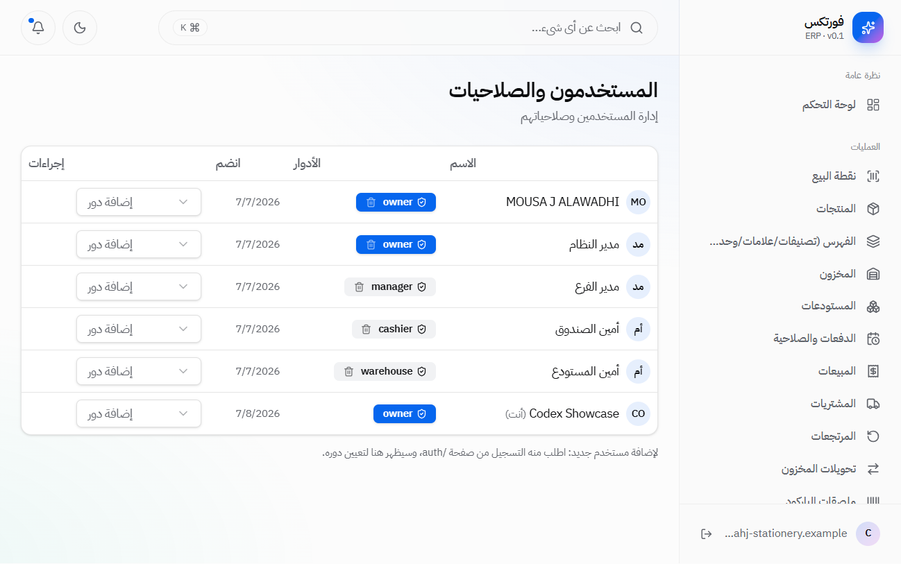](screenshots/046-users.png)<br><sub>Administration — role assignment</sub> | [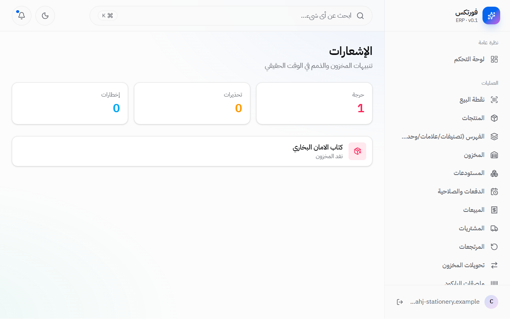](screenshots/050-notifications.png)<br><sub>Administration — stock and balance alerts</sub> | [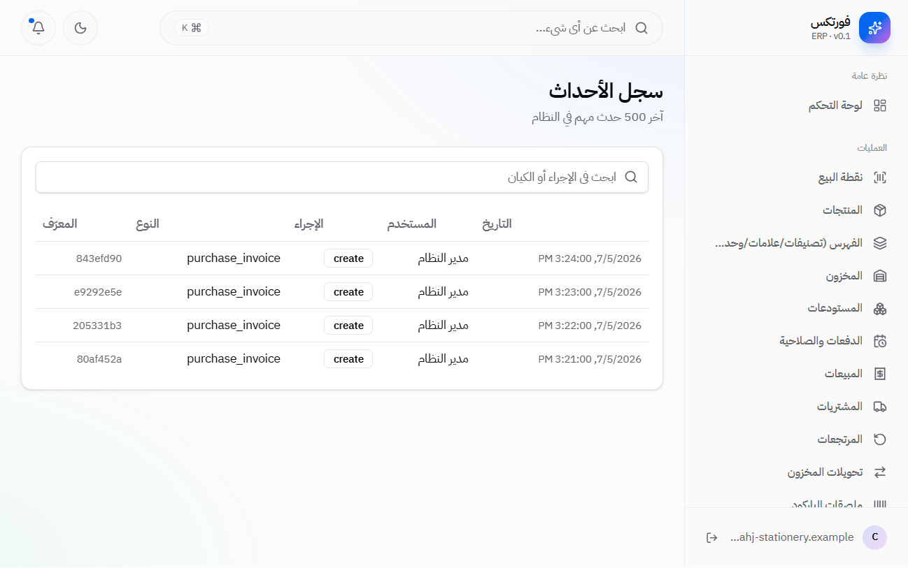](screenshots/051-audit.png)<br><sub>Administration — operational event history</sub> |

### Mobile Experience | تجربة الجوال

| POS catalog | Checkout | Dashboard |
| --- | --- | --- |
| [](<screenshots/WhatsApp%20Image%202026-07-08%20at%2011.46.21%20PM.jpeg>)<br><sub>Mobile — product browsing</sub> | [.jpeg>)](<screenshots/WhatsApp%20Image%202026-07-08%20at%2011.46.21%20PM%20(1).jpeg>)<br><sub>Mobile — payment and invoice issue</sub> | [.jpeg>)](<screenshots/WhatsApp%20Image%202026-07-08%20at%2011.46.21%20PM%20(2).jpeg>)<br><sub>Mobile — revenue insight</sub> |

---

## Key Features | الميزات الرئيسية

🇺🇸 **English**

- 🛒 **Transactional commerce:** POS, sales, purchases, returns, and warehouse transfers are tied to invoice and inventory records.
- 📦 **Traceable stock control:** products, catalog metadata, warehouse quantities, movements, batches, expiry dates, and barcode labels are managed from the same system.
- 🧾 **Operational documents:** sales documents support three print templates, PDF download, customer statements, and CSV report exports.
- 👥 **Commercial relationships:** customer and supplier records carry contact data, balances, credit limits, collections, and loyalty operations.
- 📊 **Management visibility:** dashboards, analytics, reports, low-stock signals, balance alerts, audit-log review, and role management support daily oversight.
- 🌐 **Bilingual usability:** Arabic/English dictionaries, RTL/LTR direction, responsive navigation, a command palette, and stored light/dark preference support varied operating contexts.

🇸🇦 **العربية**

- 🛒 **تجارة مترابطة:** ترتبط نقطة البيع والمبيعات والمشتريات والمرتجعات وتحويلات المستودعات بسجلات الفواتير والمخزون.
- 📦 **ضبط قابل للتتبع للمخزون:** تُدار المنتجات وبيانات الفهرس وكميات المستودعات والحركات والدفعات وتواريخ الصلاحية وملصقات الباركود من النظام نفسه.
- 🧾 **مستندات تشغيلية:** تدعم مستندات المبيعات ثلاثة قوالب للطباعة وتنزيل PDF وكشوف حساب العملاء وتصدير تقارير CSV.
- 👥 **علاقات تجارية:** تحتفظ سجلات العملاء والموردين ببيانات التواصل والأرصدة والحدود الائتمانية والتحصيلات وعمليات الولاء.
- 📊 **رؤية إدارية:** تدعم لوحات المتابعة والتحليلات والتقارير وتنبيهات نقص المخزون والأرصدة ومراجعة سجل الأحداث وإدارة الأدوار المتابعة اليومية.
- 🌐 **قابلية استخدام ثنائية اللغة:** تدعم القواميس العربية والإنجليزية واتجاهي RTL/LTR والتنقل المتجاوب ولوحة الأوامر وتفضيل السمة المحفوظ بيئات التشغيل المتنوعة.

## Module Overview | نظرة عامة على الوحدات

🇺🇸 **English**

The modules below are organized around operational responsibilities rather than navigation labels.

🇸🇦 **العربية**

تُنظَّم الوحدات التالية وفق مسؤولياتها التشغيلية، وليس وفق تسميات التنقل فقط.

| Module | Purpose | Responsibilities and Main Capabilities |
| --- | --- | --- |
| Dashboard and Analytics | Provide a current operational view. | Aggregates sales, products, inventory, customers, expenses, and purchase data into KPI cards and charts. |
| POS and Sales | Process customer-facing sales activity. | Searches or scans products, manages carts and payment methods, creates sales invoices, and produces printable/PDF documents. |
| Products and Catalog | Maintain sellable product data. | Manages products, bilingual names, SKU/barcodes, pricing, tax, minimum stock, categories, brands, and units. |
| Inventory, Warehouses, and Batches | Control physical stock. | Tracks quantities per warehouse, stock movements, manual adjustments, transfers, batches, and expiry dates. |
| Purchases and Returns | Record inbound stock and reversals. | Creates purchase invoices, increases inventory, records sales/purchase returns, and adjusts related balances. |
| Customers, Payments, and Loyalty | Manage customer relationships and collections. | Stores contact/credit data, exposes debt statements, records payments, and maintains loyalty transactions. |
| Suppliers and Finance | Support supplier and expense oversight. | Maintains supplier balances, expense categories and entries, receivables/payables, and finance summaries. |
| Reports and Documents | Turn operating data into reviewable output. | Produces report datasets, CSV exports, invoice PDFs, customer statements, barcode labels, and print layouts. |
| Administration | Govern access and configuration. | Handles authentication, roles, company settings, notifications, audit-log review, language direction, and themes. |

## System Workflow | سير العمل

🇺🇸 **English**

The sales workflow below is implemented by the `create_sale` PostgreSQL RPC function and its related tables.

🇸🇦 **العربية**

ينفذ سير المبيعات التالي عبر دالة PostgreSQL RPC المسماة `create_sale` والجداول المرتبطة بها.

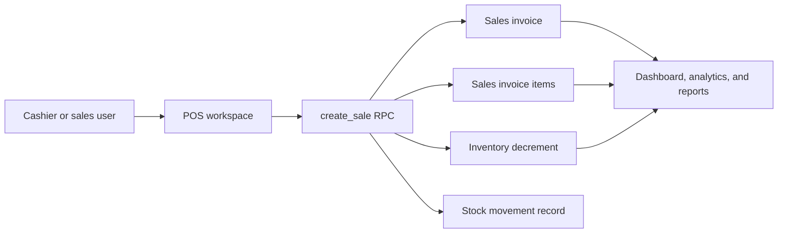
```mermaid
flowchart LR
    A[Cashier or sales user] --> B[POS workspace]
    B --> C[create_sale RPC]
    C --> D[Sales invoice]
    C --> E[Sales invoice items]
    C --> F[Inventory decrement]
    C --> G[Stock movement record]
    D --> H[Dashboard, analytics, and reports]
    E --> H
    F --> H
```

---

## Engineering Highlights | نقاط الإبداع والتميز

🇺🇸 **English**

- Transactional sales, purchases, returns, transfers, payments, and loyalty adjustments are implemented as PostgreSQL RPC functions rather than scattered client-side write sequences.
- Row Level Security and database role helpers protect business tables even when a browser can call the Supabase data API directly.
- The schema combines foreign keys, unique keys, numeric checks, update triggers, and targeted indexes to keep operational data consistent and queryable.
- The interface has first-class Arabic/English dictionaries, runtime direction switching, and RTL-aware layout rather than treating localization as static text replacement.

🇸🇦 **العربية**

- تُنفَّذ المبيعات والمشتريات والمرتجعات والتحويلات والدفعات وتسويات الولاء كدوال PostgreSQL RPC بدل سلسلة كتابات متناثرة من جهة العميل.
- تحمي Row Level Security ودوال الأدوار في قاعدة البيانات جداول الأعمال حتى مع قدرة المتصفح على استدعاء واجهة بيانات Supabase مباشرةً.
- يجمع المخطط بين المفاتيح الخارجية والقيود الفريدة والفحوصات الرقمية ومحفزات التحديث والفهارس المستهدفة للحفاظ على اتساق البيانات التشغيلية وقابليتها للاستعلام.
- تدعم الواجهة قواميس عربية وإنجليزية من الدرجة الأولى وتغيير الاتجاه أثناء التشغيل وتخطيطاً واعياً بـ RTL، بدلاً من التعامل مع الترجمة كنص ثابت فقط.

## Technology Stack

| Category | Technology | Version / Evidence |
| --- | --- | --- |
| Programming Languages | TypeScript | ^5.8.3 |

### Frontend and UI

| Category | Technology | Version / Evidence |
| --- | --- | --- |
| Frontend | React | ^19.2.0 |
| Frontend | TanStack Start and TanStack Router | ^1.167.50 / ^1.168.25 |
| UI Components | Tailwind CSS, shadcn/ui New York configuration, and Radix UI | Tailwind ^4.2.1; Radix packages are declared individually |
| Charts | Recharts | ^2.15.4 |

### Backend, Database, and Authentication

| Category | Technology | Version / Evidence |
| --- | --- | --- |
| Backend | TanStack Start server runtime and Nitro | ^1.167.50 / 3.0.260603-beta |
| Database | PostgreSQL through Supabase | Database version not declared |
| Authentication | Supabase Auth | Used for sign-up, password sign-in, session refresh, and sign-out |
| ORM | No ORM identified | Supabase JavaScript client issues table and RPC calls directly |
| Cloud | Supabase project configuration | `supabase/config.toml` and Supabase environment variables are present |

### State, Validation, and Operations

| Category | Technology | Version / Evidence |
| --- | --- | --- |
| State Management | React local state and TanStack React Query | React Query ^5.83.0; queries and mutations are used in multiple routes |
| Validation | Zod | ^3.24.2; used for authentication input validation |
| Printing | jsPDF, jspdf-autotable, and browser print layouts | ^4.2.1 / ^5.0.8 |
| QR & Barcode | html5-qrcode and JsBarcode | ^2.3.8 / ^3.12.3 |

### Build, Quality, and Delivery

| Category | Technology | Version / Evidence |
| --- | --- | --- |
| Build Tools | Vite | ^8.0.16 |
| Testing | No automated test framework or test files found | Not documented in the repository |
| DevOps | No Dockerfile, Compose file, or CI workflow found | Not documented in the repository |
| Development Tools | ESLint, Prettier, Bun configuration, and Lovable Vite/TanStack configuration | ^9.32.0 / ^3.7.3 / version not declared / 2.7.1 |

## Architecture Overview | نظرة عامة على المعمارية

🇺🇸 **English**

Vortex ERP is a modular application, not a microservice system. File-based TanStack Start routes separate operational domains, reusable components live in `src/components`, and shared concerns such as auth, localization, printing, formatting, and error handling live in `src/lib`. The browser communicates with Supabase through the typed JavaScript client, while PostgreSQL owns authorization policies and the transactional business functions.

The repository also configures a custom TanStack Start server entry that wraps SSR failures with a controlled HTML error response. This is a focused architecture for one operational console: clear domain boundaries without introducing service-to-service coordination overhead.

🇸🇦 **العربية**

فورتكس ERP تطبيق معياري وليس نظام خدمات مصغّرة. تفصل مسارات TanStack Start المبنية على الملفات بين المجالات التشغيلية، وتوجد المكونات القابلة لإعادة الاستخدام في `src/components`، بينما تتركز المصادقة والترجمة والطباعة والتنسيق ومعالجة الأخطاء في `src/lib`. يتواصل المتصفح مع Supabase من خلال عميل JavaScript المولّد للأنواع، وتبقى سياسات التفويض ودوال الأعمال المعاملاتية داخل PostgreSQL.

كما يضبط المستودع مدخلاً مخصصاً لخادم TanStack Start يغلّف أخطاء SSR باستجابة HTML مضبوطة. تناسب هذه المعمارية لوحة تشغيل واحدة: حدود مجال واضحة دون أعباء تنسيق بين خدمات متعددة.

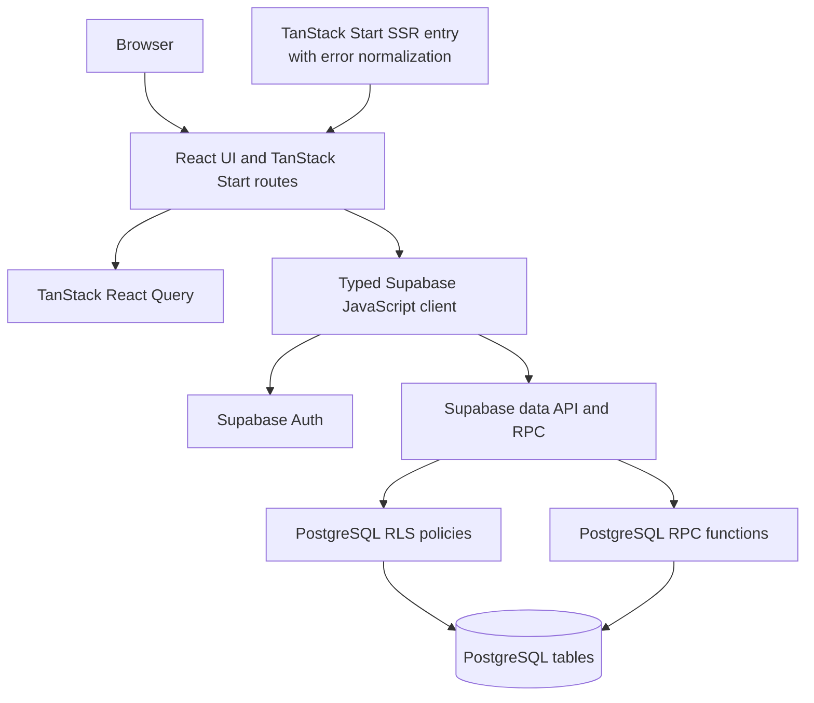
```mermaid
flowchart TB
    Browser[Browser] --> UI[React UI and TanStack Start routes]
    UI --> Query[TanStack React Query]
    UI --> Client[Typed Supabase JavaScript client]
    SSR[TanStack Start SSR entry\nwith error normalization] --> UI
    Client --> Auth[Supabase Auth]
    Client --> Data[Supabase data API and RPC]
    Data --> RLS[PostgreSQL RLS policies]
    Data --> RPC[PostgreSQL RPC functions]
    RLS --> DB[(PostgreSQL tables)]
    RPC --> DB
```

## Engineering Decisions | القرارات الهندسية

🇺🇸 **English**

The rationale below is inferred from the implementation, not from undocumented product decisions.

🇸🇦 **العربية**

التبرير التالي مستنتج من التنفيذ الفعلي وليس من قرارات منتج غير موثقة.

| Decision | Repository Evidence | Engineering Rationale |
| --- | --- | --- |
| PostgreSQL RPC for business transactions | `create_sale`, `create_purchase`, return, transfer, payment, and loyalty functions are defined in migrations and invoked from routes. | The relevant operation can validate inputs and coordinate its invoice, line-item, inventory, movement, and/or balance writes without relying on a sequence of unrelated browser calls. |
| Row Level Security with role helpers | Business tables enable RLS and policies use `has_role` and `is_staff`. | Authorization is enforced next to the data, so a client-side role display is not the sole security boundary. |
| Supabase Auth linked to public profiles | Sign-up/sign-in use Supabase Auth; database triggers create profiles and bootstrap the first owner. | Identity, session claims, profile data, and RLS checks are connected through the same managed user identity. |
| TanStack Start file-based routing | Operational modules are split across `src/routes/_app.*.tsx`; a custom server entry is configured. | The route structure keeps a broad ERP surface area navigable while retaining one app shell and one deployment unit. |
| React Query for selected data-heavy modules | Dashboard, analytics, products, inventory, warehouses, and catalog use `useQuery`; CRUD paths use mutations and query invalidation. | Query state, loading states, mutation lifecycle, and cache invalidation are centralized where the UI performs repeated reads and writes. |
| Normalized relational schema | Catalog entities, document headers/items, inventory by product/warehouse, and separate payment/loyalty/audit tables are present. | Separating master data from transaction headers and line items reduces duplicated attributes and keeps reports tied to primary operational records. |

## Performance Considerations | اعتبارات الأداء

🇺🇸 **English**

The following points describe implemented behavior and its boundaries; the repository does not publish performance benchmarks.

🇸🇦 **العربية**

تصف النقاط التالية السلوك المنفذ وحدوده؛ ولا ينشر المستودع قياسات معيارية للأداء.

| Evidence | Implementation Detail | Practical Effect / Boundary |
| --- | --- | --- |
| Parallel reads | Many route loaders use `Promise.all` for independent Supabase queries. | Reduces avoidable serial waiting when a screen needs several datasets. |
| Query management | React Query powers dashboard, analytics, products, catalog, inventory, and warehouses; mutations invalidate affected queries. | Keeps these modules synchronized after CRUD operations. No project-specific React Query cache duration is configured. |
| Bounded reads | Several routes apply explicit `limit` values, such as recent invoices, reports, audit logs, products, payments, and returns. | Prevents those views from unbounded result retrieval; the selected limits remain domain-specific implementation choices. |
| Database indexes | The schema includes a GIN product search index and indexes for batches, audit logs, loyalty, customer payments, and stock-movement references. | Provides indexed paths for the indexed fields; the repository does not include benchmark results. |
| SSR boundary | A custom SSR server entry is configured. Several routes also fetch data in client effects. | SSR error handling is explicit, while the repository does not document server-side data preloading, lazy-loading policy, or performance targets. |

## Technical Challenges | التحديات التقنية

🇺🇸 **English**

- **Inventory consistency:** sales, purchases, returns, and transfers must affect stock and its audit trail together. The database RPC functions pair validation with related inventory and stock-movement writes.
- **Role-aware access:** a multi-role operational system cannot trust page visibility alone. RLS policies and database role helpers provide enforcement beneath the interface.
- **Arabic and RTL support:** language changes affect copy, direction, alignment, navigation, and component behavior. The application centralizes translation dictionaries and applies runtime document direction.
- **ERP module breadth:** the application spans commerce, stock, finance, relationships, and governance. File-based domain routes and shared UI/library modules keep that surface area organized.

🇸🇦 **العربية**

- **اتساق المخزون:** يجب أن تؤثر المبيعات والمشتريات والمرتجعات والتحويلات في المخزون وسجل حركته معاً. تقرن دوال RPC في قاعدة البيانات التحقق بالكتابات المتعلقة بالمخزون والحركات.
- **الوصول وفق الأدوار:** لا يمكن لنظام تشغيلي متعدد الأدوار الاعتماد على إظهار الصفحة فقط. توفر سياسات RLS ودوال الأدوار في قاعدة البيانات طبقة فرض أسفل الواجهة.
- **دعم العربية وRTL:** يغير تبديل اللغة النص والاتجاه والمحاذاة والتنقل وسلوك المكونات. يركز التطبيق قواميس الترجمة ويطبق اتجاه المستند أثناء التشغيل.
- **اتساع وحدات ERP:** يشمل التطبيق التجارة والمخزون والمالية والعلاقات والحوكمة. تحافظ مسارات المجالات المبنية على الملفات ووحدات الواجهة والمكتبات المشتركة على تنظيم هذا النطاق.

## UI/UX Design

| Element | Tool/Library |
| --- | --- |
| Color system | Tailwind CSS v4 tokens and CSS custom properties using OKLCH values |
| Typography | Inter, IBM Plex Sans Arabic, and JetBrains Mono |
| Design system | shadcn/ui New York configuration with Radix UI primitives |
| Icons | Lucide React |
| Charts | Recharts |
| Feedback and notifications | Sonner |
| Layout and responsiveness | Tailwind responsive utilities, Radix Sheet, and a mobile navigation drawer |
| Direction and localization | Custom i18n provider with Arabic/English dictionaries and runtime RTL/LTR document direction |
| Theme | Persistent light/dark preference stored in browser local storage |

## Installation & Configuration

1. Ensure Node.js and npm are available. The repository includes both `package-lock.json` and Bun configuration; the documented workflow uses npm.
2. Follow the [Quick Start](#quick-start--بدء-سريع) clone and install sequence.
3. Configure Supabase. No `.env.example` file is present, so the values below are derived from the environment reads in the source code.

```bash
# .env
# VITE_SUPABASE_URL=<supabase-project-url>
# VITE_SUPABASE_PUBLISHABLE_KEY=<supabase-publishable-key>
# SUPABASE_URL=<supabase-project-url>
# SUPABASE_PUBLISHABLE_KEY=<supabase-publishable-key>
# SUPABASE_SERVICE_ROLE_KEY=<server-only-key; only when admin client is used>
```

4. Apply the SQL migrations in `supabase/migrations/` to the configured Supabase project. The repository also enables the seed definition at `supabase/seeds/seed.sql`; no repository-specific Supabase CLI command is documented.
5. Run the available quality and build scripts.

```bash
npm run lint
npm run build
npm run preview
```

Keep `SUPABASE_SERVICE_ROLE_KEY` out of `VITE_` variables and client code. The server-only administrative client is isolated in `src/integrations/supabase/client.server.ts`.

## Project Structure

```text
market-hub/
├── public/
├── screenshots/
├── src/
├── supabase/
├── .env
├── bun.lock
├── package-lock.json
├── package.json
├── tsconfig.json
└── vite.config.ts
```

## Services Provided

| Service | Value Delivered |
| --- | --- |
| Sales operations | Gives cashiers and sales teams a POS workflow, invoice history, payment handling, and printable sales documents. |
| Stock and warehouse operations | Helps warehouse teams track inventory, adjustments, expiry batches, and transfers across storage locations. |
| Procurement and supplier management | Supports goods receiving, supplier records, supplier balances, and purchase returns. |
| Customer relationship management | Maintains customer data, credit limits, balances, statements, loyalty points, and collections. |
| Financial oversight | Consolidates expenses, receivables, payables, and finance-oriented summaries. |
| Business intelligence | Gives managers dashboards, analytics, low-stock visibility, reports, and CSV exports. |
| Administrative governance | Provides user-role administration, company settings, operational alerts, and audit-log review. |

## API Overview

> **Integration boundary:** the repository does not define an application-owned REST or GraphQL API. The UI communicates through Supabase Auth, typed table queries, and authenticated PostgreSQL RPC functions.

| Area | Supabase Integration | Responsibility |
| --- | --- | --- |
| Authentication | Supabase Auth | Email/password sign-up, password sign-in, session retrieval/refresh, sign-out, and a server-side bearer-token claim-validation helper. |
| Products and Catalog | Table queries for products, categories, brands, and units | Product data, prices, stock thresholds, SKU/barcode identifiers, and catalog metadata. |
| Inventory | Inventory and stock-movement tables; transaction RPC functions | Per-warehouse stock, adjustments, movements, batches, expiry, and stock transfers. |
| Sales | `create_sale` RPC with sales invoice tables | Validates the sale, creates invoice records, decrements inventory, and records stock movements. |
| Purchases | `create_purchase` RPC with purchase invoice tables | Creates purchase records, increases inventory, records movements, and updates supplier balance when applicable. |
| Finance | Expense tables and `record_customer_payment` RPC | Expense entry, customer collection, invoice payment status, and customer balance updates. |
| Reports | Read queries over operational tables | Client-side report aggregation, dashboard data, analytics, and CSV export. |
| Administration | Profiles, roles, settings, notifications, and audit-log tables | Access control, company configuration, operational alerts, and history review. |

## Database Overview | نظرة عامة على قاعدة البيانات

🇺🇸 **English**

The application uses PostgreSQL through Supabase. Its relational model separates identity, master data, inventory, transaction headers, transaction lines, finance, and audit history. Supabase-managed `auth.users` is linked to public `profiles` and `user_roles`; products optionally reference categories, brands, and units; inventory is uniquely scoped to a product and warehouse.

Sales and purchases use invoice-header and invoice-item tables. Returns and stock transfers follow comparable header/item structures. Customer payments, loyalty transactions, expenses, batches, and audit logs retain their own financial or operational history rather than duplicating data into invoice rows.

The schema protects integrity with foreign keys, unique constraints for SKU, barcode, role assignment, batch identity, and product/warehouse inventory, numeric checks, and trigger-maintained `updated_at` fields. It also includes a GIN product search index over English/Arabic names, SKU, and barcode, plus targeted indexes for expiry dates, audit history, loyalty activity, customer payments, and stock-movement references.

🇸🇦 **العربية**

يستخدم التطبيق PostgreSQL عبر Supabase. يفصل نموذجه العلائقي بين الهوية والبيانات الأساسية والمخزون ورؤوس المعاملات وبنودها والمالية وسجل التدقيق. يرتبط `auth.users` المُدار من Supabase بجدولي `profiles` و`user_roles` العامين؛ ويمكن للمنتجات الارتباط بالتصنيفات والعلامات والوحدات، بينما يُضبط المخزون بشكل فريد لكل منتج ومستودع.

تستخدم المبيعات والمشتريات جداول لرأس الفاتورة وبنودها، وتتبع المرتجعات وتحويلات المخزون بنية رأس/بنود مماثلة. وتحتفظ دفعات العملاء ومعاملات الولاء والمصروفات والدفعات وسجل التدقيق بتاريخها المالي أو التشغيلي الخاص بدلاً من تكرار البيانات داخل بنود الفواتير.

يحمي المخطط سلامة البيانات بالمفاتيح الخارجية والقيود الفريدة للـSKU والباركود وتعيين الأدوار وهوية الدفعة ومخزون المنتج/المستودع، وبالفحوصات الرقمية وحقول `updated_at` التي تحدثها المحفزات. كما يتضمن فهرس GIN للبحث في أسماء المنتجات العربية والإنجليزية وSKU والباركود، وفهارس مستهدفة لتواريخ الصلاحية وسجل التدقيق والولاء ودفعات العملاء ومراجع حركات المخزون.

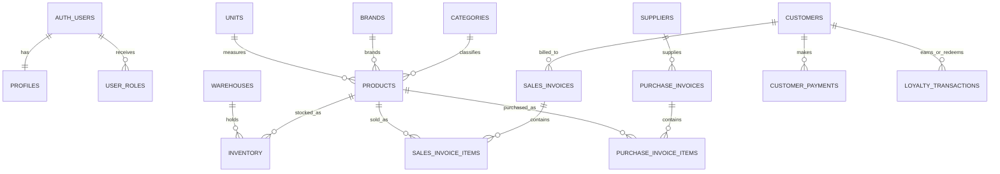
```mermaid
erDiagram
    AUTH_USERS ||--|| PROFILES : has
    AUTH_USERS ||--o{ USER_ROLES : receives
    CATEGORIES ||--o{ PRODUCTS : classifies
    BRANDS ||--o{ PRODUCTS : brands
    UNITS ||--o{ PRODUCTS : measures
    PRODUCTS ||--o{ INVENTORY : stocked_as
    WAREHOUSES ||--o{ INVENTORY : holds
    CUSTOMERS ||--o{ SALES_INVOICES : billed_to
    SALES_INVOICES ||--o{ SALES_INVOICE_ITEMS : contains
    PRODUCTS ||--o{ SALES_INVOICE_ITEMS : sold_as
    SUPPLIERS ||--o{ PURCHASE_INVOICES : supplies
    PURCHASE_INVOICES ||--o{ PURCHASE_INVOICE_ITEMS : contains
    PRODUCTS ||--o{ PURCHASE_INVOICE_ITEMS : purchased_as
    CUSTOMERS ||--o{ CUSTOMER_PAYMENTS : makes
    CUSTOMERS ||--o{ LOYALTY_TRANSACTIONS : earns_or_redeems
```

## Security | الأمان

🇺🇸 **English**

- **Authentication:** email/password sign-up and sign-in are handled through Supabase Auth; the client restores and refreshes authenticated sessions.
- **Route guard:** the protected application layout redirects visitors without a session to `/auth`.
- **Database authorization:** Row Level Security is enabled on the business tables. Policies use five application roles—owner, manager, accountant, cashier, and warehouse—through `has_role` and `is_staff` helpers.
- **Transactional authorization:** security-definer RPC functions verify `auth.uid()` and staff status before executing sensitive sale, purchase, return, transfer, loyalty, or customer-payment operations.
- **RPC execution hardening:** migrations revoke execution from public and anonymous roles for privileged helpers and transaction functions, then grant authenticated access to the intended business RPC functions.
- **Input validation:** Zod validates authentication input, including email format and bounded password/full-name lengths.
- **Secret isolation:** `.env` files are ignored by Git. The server-only Supabase admin client requires a service-role key and is isolated in `src/integrations/supabase/client.server.ts`.

🇸🇦 **العربية**

- **المصادقة:** يتولى Supabase Auth التسجيل والدخول بالبريد الإلكتروني وكلمة المرور، ويستعيد العميل الجلسات الموثقة ويحدّثها.
- **حماية المسارات:** يعيد تخطيط التطبيق المحمي توجيه الزائر الذي لا يملك جلسة إلى `/auth`.
- **تفويض قاعدة البيانات:** تُفعّل Row Level Security على جداول الأعمال. وتستخدم السياسات خمسة أدوار تطبيقية—المالك والمدير والمحاسب وأمين الصندوق والمستودع—من خلال الدالتين `has_role` و`is_staff`.
- **تفويض المعاملات:** تتحقق دوال RPC ذات امتيازات الأمان من `auth.uid()` وحالة الموظف قبل تنفيذ عمليات البيع والشراء والمرتجعات والتحويلات والولاء ودفعات العملاء الحساسة.
- **تحصين تنفيذ RPC:** تسحب الترحيلات صلاحية التنفيذ من الأدوار العامة والمجهولة للدوال المميزة ودوال المعاملات، ثم تمنح المستخدمين الموثقين الوصول إلى دوال الأعمال المقصودة.
- **التحقق من المدخلات:** يتحقق Zod من مدخلات المصادقة، بما فيها تنسيق البريد الإلكتروني وأطوال كلمة المرور والاسم الكامل.
- **عزل الأسرار:** تُستثنى ملفات `.env` من Git. ويتطلب عميل Supabase الإداري الخاص بالخادم مفتاح service-role ويُعزل في `src/integrations/supabase/client.server.ts`.

## Deployment | النشر

🇺🇸 **English**

The live project preview is available on [Vercel](https://market-hub-two-theta.vercel.app/). To produce the deployable application bundle, configure the Supabase environment values described in [Installation & Configuration](#installation--configuration--التثبيت-والإعداد), then run `npm run build`. The package also provides `npm run preview` for a local production-build check. Hosting configuration and release automation are managed outside this repository.

🇸🇦 **العربية**

تتوفر معاينة المشروع المباشرة على [Vercel](https://market-hub-two-theta.vercel.app/). لإنتاج حزمة التطبيق القابلة للنشر، اضبط قيم بيئة Supabase الموضحة في [التثبيت والإعداد](#installation--configuration--التثبيت-والإعداد)، ثم شغّل `npm run build`. كما يوفر المشروع `npm run preview` لفحص حزمة الإنتاج محلياً. تُدار إعدادات الاستضافة وأتمتة الإصدارات خارج هذا المستودع.

**Live URL:** https://market-hub-two-theta.vercel.app/

## Roadmap | خارطة الطريق

🇺🇸 **English**

The following owner-proposed priorities are intentionally separated from the implementation backlog.

- [ ] Progressive Web App (PWA) capabilities.
- [ ] Multi-branch operational support.
- [ ] Offline workflows for selected point-of-sale scenarios.
- [ ] Expanded analytics and operational insights.
- [ ] Enhanced notification center.
- [ ] Localization refinements.
- [ ] Performance tuning informed by production usage.

🇸🇦 **العربية**

تفصل الأولويات التالية التي اقترحها مالك المشروع عمداً عن قائمة مهام التنفيذ.

- [ ] إمكانات تطبيق الويب التقدمي (PWA).
- [ ] دعم التشغيل متعدد الفروع.
- [ ] مسارات عمل دون اتصال لسيناريوهات محددة من نقطة البيع.
- [ ] توسيع التحليلات والرؤى التشغيلية.
- [ ] مركز إشعارات محسن.
- [ ] تحسينات في التوطين ودعم اللغات.
- [ ] تحسين الأداء بناءً على استخدام الإنتاج.

## Development Team

| Name | Responsibilities |
| --- | --- |
| **المهندس موسى** | المسؤول التقني في فريق Inama Soft |

---

<div align="center">


**Made with ❤️ by Inama Soft**

Collaborative Development Group · Mousa Gamil Al-Awadhi

Ibb, Yemen · [mousa.mc13@gmail.com](mailto:mousa.mc13@gmail.com) · [+967 772 217 218](tel:+967772217218)

[Website](https://inma-soft.vercel.app) · [LinkedIn](https://www.linkedin.com/in/mousa-al-awadhi-6518633a8) · [GitHub](https://github.com/mosaa65) · [Live Project](https://market-hub-two-theta.vercel.app/)

تم التطوير بواسطة فريق Inama Soft © 2026

</div>
