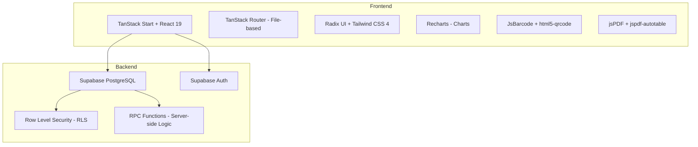
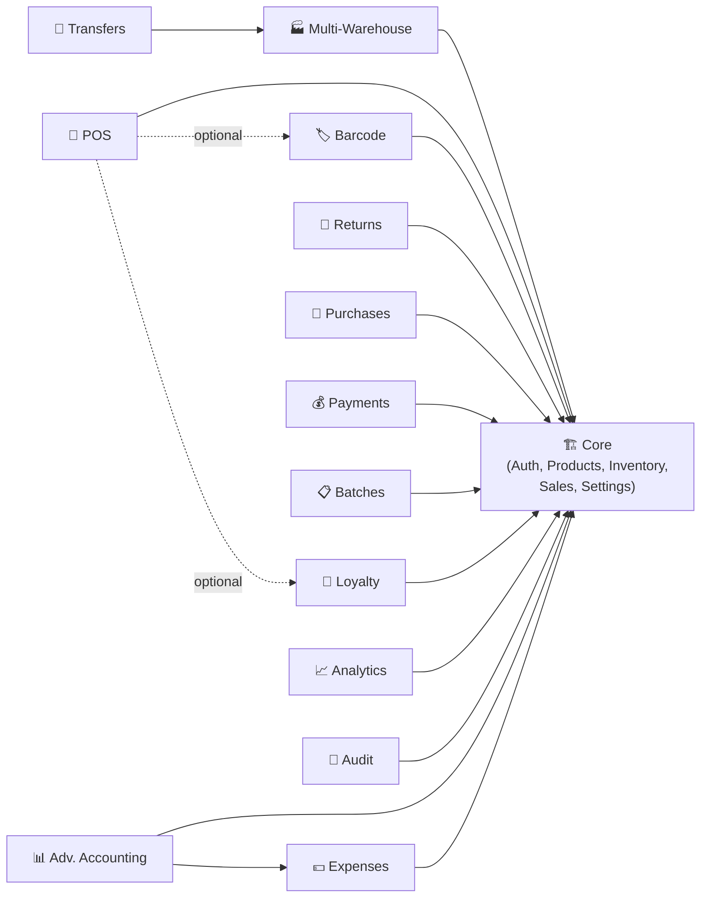

# خطة التنفيذ المختصرة

1. مراجعة تكامل المنتجات والمخزون، المستودعات، الخطط، الصلاحيات، المشتريات، المبيعات، POS، PDF/Excel.
2. توحيد ربط إعدادات المنتجات والمخزون مع البيانات الحالية، مع إخفاء الخيارات غير المتاحة حسب الخطة أو الدور.
3. إصلاح صفحة المنتجات لإظهار المعلومات المهمة من المخزون والمستودع مع الترجمة العربية الكاملة.
4. تحسين المخزون والتسويات مع سجل تدقيق واضح وقيود صلاحيات.
5. إضافة PDF ومشاركة للفاتورة في المبيعات وPOS مع إعدادات تشغيل/إيقاف حسب النظام.
6. توحيد تصدير Excel في المشتريات والمبيعات والنقطة البيع، مع الحفاظ على سلامة البيانات وعدم المساس بقواعد RLS والصلاحيات.
7. اختبار Build/TypeScript/ESLint ثم Commit على الـBranch الحالي ورفعها إلى GitHub.

---

# خطة تحليل وتجزئة نظام Vortex ERP — التحويل إلى منتج قابل للبيع بالباقات

---

## 1. ملخص تنفيذي

### الوضع الحالي

نظام Vortex ERP هو تطبيق **monolithic** مبني بـ TanStack Start (React + Vite) مع Supabase كـ backend (PostgreSQL + Auth + RLS). المشروع يعمل كنسخة واحدة (single-tenant) بدون أي آلية لفصل الميزات أو إدارة الباقات.

### التحدي الجوهري

جميع الميزات **مكشوفة ومتاحة** لجميع المستخدمين بمجرد تسجيل الدخول. لا يوجد:

- نظام Feature Flags
- طبقة Entitlements / Licensing
- آلية Module Registry
- فصل بين صلاحيات المنصة وصلاحيات المستأجر/العميل

### الهدف

تحويل النظام إلى **منتج ERP قابل للبيع على باقات** مع:

- Core ثابت لا يمكن تعطيله
- وحدات اختيارية (Modules) يمكن تفعيلها/تعطيلها حسب الباقة
- ميزات إضافية (Add-ons) يمكن شراؤها بشكل مستقل
- نظام صلاحيات متعدد المستويات يفصل بين المنصة والعميل

---

## 2. خريطة المشروع الحالية

### 2.1 البنية التقنية



### 2.2 جداول قاعدة البيانات (24 جدول)

| الجدول                   | الغرض                               | العلاقات الرئيسية                          |
| ------------------------ | ----------------------------------- | ------------------------------------------ |
| `profiles`               | بيانات المستخدمين                   | ← `auth.users`                             |
| `user_roles`             | الأدوار والصلاحيات                  | ← `auth.users`                             |
| `company_settings`       | إعدادات الشركة (صف واحد)            | مستقل                                      |
| `warehouses`             | المستودعات                          | مستقل                                      |
| `categories`             | تصنيفات المنتجات                    | self-ref (parent)                          |
| `brands`                 | العلامات التجارية                   | مستقل                                      |
| `units`                  | وحدات القياس                        | مستقل                                      |
| `products`               | المنتجات                            | ← categories, brands, units                |
| `inventory`              | المخزون (product × warehouse)       | ← products, warehouses                     |
| `stock_movements`        | حركات المخزون                       | ← products, warehouses                     |
| `stock_transfers`        | تحويلات المخزون                     | ← warehouses (from/to)                     |
| `stock_transfer_items`   | بنود التحويل                        | ← stock_transfers, products                |
| `product_batches`        | الدفعات وتواريخ الانتهاء            | ← products, warehouses                     |
| `customers`              | العملاء (+ loyalty_points, balance) | مستقل                                      |
| `suppliers`              | الموردون (+ balance)                | مستقل                                      |
| `sales_invoices`         | فواتير المبيعات                     | ← customers, warehouses                    |
| `sales_invoice_items`    | بنود فاتورة المبيعات                | ← sales_invoices, products                 |
| `purchase_invoices`      | فواتير المشتريات                    | ← suppliers, warehouses                    |
| `purchase_invoice_items` | بنود فاتورة المشتريات               | ← purchase_invoices, products              |
| `sales_returns`          | مرتجعات المبيعات                    | ← sales_invoices, customers, warehouses    |
| `sales_return_items`     | بنود مرتجع المبيعات                 | ← sales_returns, products                  |
| `purchase_returns`       | مرتجعات المشتريات                   | ← purchase_invoices, suppliers, warehouses |
| `purchase_return_items`  | بنود مرتجع المشتريات                | ← purchase_returns, products               |
| `customer_payments`      | الدفعات والتحصيلات                  | ← customers, sales_invoices                |
| `loyalty_transactions`   | حركات نقاط الولاء                   | ← customers                                |
| `expenses`               | المصروفات                           | ← expense_categories                       |
| `expense_categories`     | تصنيفات المصروفات                   | مستقل                                      |
| `audit_logs`             | سجل التدقيق                         | مستقل                                      |

### 2.3 صفحات التطبيق (34 صفحة route)

| القسم         | الصفحات                                                                                                                        |
| ------------- | ------------------------------------------------------------------------------------------------------------------------------ |
| **نظرة عامة** | Dashboard, Analytics                                                                                                           |
| **العمليات**  | POS, Products, Catalog, Inventory, Warehouses, Batches, Sales, Sales Returns, Purchases, Purchase Returns, Transfers, Barcodes |
| **العلاقات**  | Customers, Suppliers, Loyalty                                                                                                  |
| **المحاسبة**  | Payments, Debts, Account Statement, Daily Journal, Trial Balance, Income Statement, Balance Sheet, Finance, Reports            |
| **الإدارة**   | Users, Audit, Notifications, Settings                                                                                          |
| **النظام**    | Auth, Root, App Layout                                                                                                         |

### 2.4 الأدوار الحالية

```
app_role ENUM: owner | manager | accountant | cashier | warehouse
```

### 2.5 RPC Functions (Server-side)

| الدالة                    | الوظيفة                                             |
| ------------------------- | --------------------------------------------------- |
| `create_sale`             | إنشاء فاتورة مبيعات + خصم مخزون + تحديث رصيد العميل |
| `create_purchase`         | إنشاء فاتورة مشتريات + إضافة مخزون                  |
| `create_sales_return`     | مرتجع مبيعات                                        |
| `create_purchase_return`  | مرتجع مشتريات                                       |
| `create_stock_transfer`   | تحويل مخزون بين المستودعات                          |
| `record_customer_payment` | تسجيل دفعة عميل                                     |
| `adjust_loyalty`          | تعديل نقاط الولاء                                   |
| `has_role` / `is_staff`   | فحص الصلاحيات                                       |
| `next_*_number`           | توليد أرقام تسلسلية                                 |

---

## 3. الوحدات الأساسية (Core — لا يمكن تعطيلها)

> [!IMPORTANT]
> هذه الوحدات تمثل **الحد الأدنى لتشغيل النظام**. أي باقة يجب أن تحتوي عليها.

### 3.1 إدارة المستخدمين والمصادقة

- **ملفات**: [`auth.tsx`](file:///c:/Users/mousa/Desktop/project/market-hup/src/lib/auth.tsx), [`_app.users.tsx`](file:///c:/Users/mousa/Desktop/project/market-hup/src/routes/_app.users.tsx), [`auth.tsx`](file:///c:/Users/mousa/Desktop/project/market-hup/src/routes/auth.tsx)
- **جداول**: `profiles`, `user_roles`
- **سبب التصنيف**: لا يمكن تشغيل النظام بدون مصادقة وصلاحيات
- **تصنيف**: `Core`

### 3.2 إعدادات الشركة

- **ملفات**: [`_app.settings.tsx`](file:///c:/Users/mousa/Desktop/project/market-hup/src/routes/_app.settings.tsx)
- **جداول**: `company_settings`
- **سبب التصنيف**: بيانات الشركة والعملة والضريبة أساسية لكل العمليات
- **تصنيف**: `Core`

### 3.3 المنتجات والتصنيفات

- **ملفات**: [`_app.products.tsx`](file:///c:/Users/mousa/Desktop/project/market-hup/src/routes/_app.products.tsx), [`_app.catalog.tsx`](file:///c:/Users/mousa/Desktop/project/market-hup/src/routes/_app.catalog.tsx)
- **جداول**: `products`, `categories`, `brands`, `units`
- **سبب التصنيف**: جوهر أي نظام تجاري — لا بيع ولا شراء بدون منتجات
- **تصنيف**: `Core`

### 3.4 المخزون الأساسي (مستودع واحد)

- **ملفات**: [`_app.inventory.tsx`](file:///c:/Users/mousa/Desktop/project/market-hup/src/routes/_app.inventory.tsx)
- **جداول**: `inventory`, `stock_movements`, `warehouses` (واحد فقط)
- **سبب التصنيف**: تتبع الكميات ضروري للبيع. المستودع الافتراضي يُنشأ تلقائياً
- **تصنيف**: `Core`

### 3.5 المبيعات الأساسية

- **ملفات**: [`_app.sales.tsx`](file:///c:/Users/mousa/Desktop/project/market-hup/src/routes/_app.sales.tsx)
- **جداول**: `sales_invoices`, `sales_invoice_items`
- **RPC**: `create_sale`, `next_invoice_number`
- **سبب التصنيف**: عملية البيع هي العملية الأساسية في أي نظام تجاري
- **تصنيف**: `Core`

### 3.6 العملاء والموردون الأساسيون

- **ملفات**: [`_app.customers.tsx`](file:///c:/Users/mousa/Desktop/project/market-hup/src/routes/_app.customers.tsx), [`_app.suppliers.tsx`](file:///c:/Users/mousa/Desktop/project/market-hup/src/routes/_app.suppliers.tsx)
- **جداول**: `customers`, `suppliers`
- **سبب التصنيف**: مرتبطون بالفواتير والمدفوعات بشكل مباشر
- **تصنيف**: `Core`

### 3.7 لوحة المعلومات الأساسية

- **ملفات**: [`_app.dashboard.tsx`](file:///c:/Users/mousa/Desktop/project/market-hup/src/routes/_app.dashboard.tsx)
- **سبب التصنيف**: واجهة رئيسية لعرض حالة النظام
- **تصنيف**: `Core`

### 3.8 الترجمة والتدويل (i18n)

- **ملفات**: [`i18n.tsx`](file:///c:/Users/mousa/Desktop/project/market-hup/src/lib/i18n.tsx)
- **سبب التصنيف**: النظام ثنائي اللغة من الأساس
- **تصنيف**: `Core`

### 3.9 الإشعارات الأساسية

- **ملفات**: [`_app.notifications.tsx`](file:///c:/Users/mousa/Desktop/project/market-hup/src/routes/_app.notifications.tsx)
- **سبب التصنيف**: تنبيهات نفاد المخزون والديون ضرورية لأي مستخدم
- **تصنيف**: `Core`

---

## 4. الوحدات القابلة للفصل

### 4.1 📦 وحدة نقاط البيع (POS Module)

| البُعد               | التفاصيل                                                                                                          |
| -------------------- | ----------------------------------------------------------------------------------------------------------------- |
| **التصنيف**          | `Optional Module` — باقة أساسية+                                                                                  |
| **الملفات**          | [`_app.pos.tsx`](file:///c:/Users/mousa/Desktop/project/market-hup/src/routes/_app.pos.tsx) (1424 سطر — أكبر ملف) |
| **الجداول**          | يستخدم `products`, `inventory`, `warehouses`, `customers`, `sales_invoices`                                       |
| **اعتماد على Core**  | ✅ يعتمد على المنتجات، المخزون، العملاء، المبيعات                                                                 |
| **وحدات تعتمد عليه** | ❌ لا شيء يعتمد عليه مباشرة                                                                                       |

**تأثير الفصل:**

- **الواجهة**: إخفاء رابط `/pos` من القائمة الجانبية وCommand Palette
- **البيانات**: لا يحتاج جداول خاصة — يستخدم نفس جداول المبيعات
- **الصلاحيات**: دور `cashier` يصبح أقل فائدة بدون POS
- **ملاحظة مهمة**: POS يستخدم `useCatalogModules()` لعرض فلاتر حسب نوع النشاط (قطع غيار/بقالة/تجزئة)

---

### 4.2 🏭 وحدة تعدد المستودعات (Multi-Warehouse Module)

| البُعد      | التفاصيل                                                                                                                                                                                                           |
| ----------- | ------------------------------------------------------------------------------------------------------------------------------------------------------------------------------------------------------------------ |
| **التصنيف** | `Optional Module` — باقة متقدمة                                                                                                                                                                                    |
| **الملفات** | [`_app.warehouses.tsx`](file:///c:/Users/mousa/Desktop/project/market-hup/src/routes/_app.warehouses.tsx), [`_app.transfers.tsx`](file:///c:/Users/mousa/Desktop/project/market-hup/src/routes/_app.transfers.tsx) |
| **الجداول** | `warehouses`, `stock_transfers`, `stock_transfer_items`                                                                                                                                                            |
| **RPC**     | `create_stock_transfer`                                                                                                                                                                                            |

**تأثير الفصل:**

- **المنتجات**: إخفاء عمود المستودع في صفحة المخزون، وجعل النظام يختار المستودع الافتراضي تلقائياً
- **نقاط البيع**: إخفاء dropdown اختيار المستودع
- **التحويلات**: إخفاء صفحة `/transfers` بالكامل
- **التقارير**: إخفاء فلتر المستودع من التقارير
- **الإعدادات**: إخفاء قسم إدارة المستودعات
- **الجداول**: الجدول `warehouses` يبقى بصف واحد (المستودع الافتراضي). الجدول `stock_transfers` يبقى فارغاً
- **الواجهة**: في كل فورم فيه `warehouse_id` selector → إخفاء الـ selector وملء القيمة تلقائياً بالمستودع الافتراضي

**ما يتغير في RPC:**

- `create_sale`, `create_purchase`, `create_sales_return`, `create_purchase_return` → تبقى كما هي (تأخذ `warehouse_id` كمعامل)، لكن الـ frontend يمرر المستودع الافتراضي تلقائياً

---

### 4.3 🏷️ وحدة الباركود (Barcode Module)

| البُعد      | التفاصيل                                                                                                                                                                                                             |
| ----------- | -------------------------------------------------------------------------------------------------------------------------------------------------------------------------------------------------------------------- |
| **التصنيف** | `Add-on`                                                                                                                                                                                                             |
| **الملفات** | [`_app.barcodes.tsx`](file:///c:/Users/mousa/Desktop/project/market-hup/src/routes/_app.barcodes.tsx), [`barcode-scanner.tsx`](file:///c:/Users/mousa/Desktop/project/market-hup/src/components/barcode-scanner.tsx) |
| **الجداول** | حقل `barcode` في `products`، حقل `barcode_enabled` في `company_settings`                                                                                                                                             |
| **مكتبات**  | `jsbarcode`, `html5-qrcode`                                                                                                                                                                                          |

**تأثير الفصل:**

- **المنتجات**: إخفاء حقل الباركود من نموذج إضافة/تعديل المنتج
- **نقاط البيع**: إخفاء زر الماسح الضوئي وإلغاء الاستماع لمدخلات الماسح
- **الجرد**: إخفاء خيار المسح بالباركود
- **الطباعة**: إخفاء صفحة `/barcodes` بالكامل (طباعة الملصقات)
- **الإعدادات**: حقل `barcode_enabled` موجود فعلاً — يمكن ربطه بالـ feature flag
- **ملاحظة**: هذا الـ Add-on عنده نواة جاهزة (`barcode_enabled` في `company_settings`) لكنها غير مفعلة كـ feature flag حقيقي

---

### 4.4 🎁 وحدة الولاء (Loyalty Module)

| البُعد      | التفاصيل                                                                                            |
| ----------- | --------------------------------------------------------------------------------------------------- |
| **التصنيف** | `Add-on`                                                                                            |
| **الملفات** | [`_app.loyalty.tsx`](file:///c:/Users/mousa/Desktop/project/market-hup/src/routes/_app.loyalty.tsx) |
| **الجداول** | `loyalty_transactions`, حقل `loyalty_points` في `customers`                                         |
| **RPC**     | `adjust_loyalty`                                                                                    |

**تأثير الفصل:**

- **العملاء**: إخفاء عمود نقاط الولاء من قائمة العملاء
- **نقاط البيع**: إذا فُعّل POS → إخفاء أي عرض لنقاط العميل في واجهة البيع
- **الفواتير**: لا تأثير مباشر (الولاء لا يُحسم من الفاتورة حالياً)
- **المرتجعات**: لا تأثير (لا يوجد استرداد نقاط تلقائي)
- **القائمة**: إخفاء رابط `/loyalty` من القائمة الجانبية
- **القاعدة**: حقل `loyalty_points` يبقى في `customers` بقيمة 0 دائماً. جدول `loyalty_transactions` يبقى فارغاً
- **ما يجب أن يكون configurable**: نسبة النقاط لكل وحدة نقدية، الحد الأدنى للاستبدال، قواعد الانتهاء

---

### 4.5 💰 وحدة المحاسبة المتقدمة (Advanced Accounting Module)

| البُعد      | التفاصيل                                                                                                                                                                                                                                                                                                                                                                                                                                                                 |
| ----------- | ------------------------------------------------------------------------------------------------------------------------------------------------------------------------------------------------------------------------------------------------------------------------------------------------------------------------------------------------------------------------------------------------------------------------------------------------------------------------ |
| **التصنيف** | `Enterprise-only`                                                                                                                                                                                                                                                                                                                                                                                                                                                        |
| **الملفات** | [`_app.daily-journal.tsx`](file:///c:/Users/mousa/Desktop/project/market-hup/src/routes/_app.daily-journal.tsx), [`_app.trial-balance.tsx`](file:///c:/Users/mousa/Desktop/project/market-hup/src/routes/_app.trial-balance.tsx), [`_app.income-statement.tsx`](file:///c:/Users/mousa/Desktop/project/market-hup/src/routes/_app.income-statement.tsx), [`_app.balance-sheet.tsx`](file:///c:/Users/mousa/Desktop/project/market-hup/src/routes/_app.balance-sheet.tsx) |

**تأثير الفصل:**

- **القائمة**: إخفاء 4 روابط من قسم المحاسبة
- **البيانات**: هذه الصفحات **تقارير حسابية فقط** — تقرأ من جداول المبيعات والمشتريات والمصروفات بدون جداول خاصة
- **لا تأثير على بقية النظام** عند إخفائها

---

### 4.6 📊 وحدة التحليلات المتقدمة (Advanced Analytics Module)

| البُعد      | التفاصيل                                                                                                                                                                                                               |
| ----------- | ---------------------------------------------------------------------------------------------------------------------------------------------------------------------------------------------------------------------- |
| **التصنيف** | `Optional Module` — باقة متقدمة                                                                                                                                                                                        |
| **الملفات** | [`_app.analytics.tsx`](file:///c:/Users/mousa/Desktop/project/market-hup/src/routes/_app.analytics.tsx) (504 سطر)، [`_app.reports.tsx`](file:///c:/Users/mousa/Desktop/project/market-hup/src/routes/_app.reports.tsx) |

**تأثير الفصل:**

- **الواجهة**: إخفاء `/analytics` و `/reports` من القائمة
- **البيانات**: تقارير قراءة فقط — لا تأثير بنيوي
- **Dashboard**: يبقى كما هو (يحتوي ملخصات أساسية مختلفة عن Analytics)

---

### 4.7 🧾 وحدة الدفعات والتحصيلات والذمم (Receivables & Payments Module)

| البُعد      | التفاصيل                                                                                                                                                                                                                                                                                                                        |
| ----------- | ------------------------------------------------------------------------------------------------------------------------------------------------------------------------------------------------------------------------------------------------------------------------------------------------------------------------------- |
| **التصنيف** | `Optional Module` — باقة أساسية+                                                                                                                                                                                                                                                                                                |
| **الملفات** | [`_app.payments.tsx`](file:///c:/Users/mousa/Desktop/project/market-hup/src/routes/_app.payments.tsx), [`_app.debts.tsx`](file:///c:/Users/mousa/Desktop/project/market-hup/src/routes/_app.debts.tsx), [`_app.account-statement.tsx`](file:///c:/Users/mousa/Desktop/project/market-hup/src/routes/_app.account-statement.tsx) |
| **الجداول** | `customer_payments`                                                                                                                                                                                                                                                                                                             |
| **RPC**     | `record_customer_payment`                                                                                                                                                                                                                                                                                                       |

**تأثير الفصل:**

- **هل هي وحدة مالية مستقلة**: نعم، لكن بترابط قوي مع `customers` و `sales_invoices`
- **ترابطها مع العملاء والفواتير**: حقل `balance` في `customers` يُحدّث عند إنشاء فاتورة بيع (عبر `create_sale` RPC). هذا الحقل Core. لكن واجهات عرض الذمم والدفعات وكشف الحساب هي الاختيارية
- **هل تُفصل عن التقارير**: نعم — كشف الحساب وتفصيلات الديون هي واجهات مستقلة
- **الحد الأدنى للـ Add-on**: إبقاء حقل `balance` في Core وإخفاء واجهات الدفعات والذمم وكشف الحساب

---

### 4.8 🔄 وحدة المرتجعات (Returns Module)

| البُعد      | التفاصيل                                                                                                                                                                                                                               |
| ----------- | -------------------------------------------------------------------------------------------------------------------------------------------------------------------------------------------------------------------------------------- |
| **التصنيف** | `Optional Module` — باقة أساسية+                                                                                                                                                                                                       |
| **الملفات** | [`_app.sales-returns.tsx`](file:///c:/Users/mousa/Desktop/project/market-hup/src/routes/_app.sales-returns.tsx), [`_app.purchase-returns.tsx`](file:///c:/Users/mousa/Desktop/project/market-hup/src/routes/_app.purchase-returns.tsx) |
| **الجداول** | `sales_returns`, `sales_return_items`, `purchase_returns`, `purchase_return_items`                                                                                                                                                     |
| **RPC**     | `create_sales_return`, `create_purchase_return`                                                                                                                                                                                        |

**تأثير الفصل:**

- **المبيعات**: إخفاء زر "مرتجع" من تفاصيل الفاتورة
- **المشتريات**: إخفاء زر "مرتجع" من تفاصيل فاتورة الشراء
- **المخزون**: حركات `return_in`/`return_out` لن تُنشأ
- **التقارير**: إخفاء بيانات المرتجعات من التقارير المالية

---

### 4.9 🛒 وحدة المشتريات (Purchases Module)

| البُعد      | التفاصيل                                                                                                |
| ----------- | ------------------------------------------------------------------------------------------------------- |
| **التصنيف** | `Optional Module` — باقة أساسية+                                                                        |
| **الملفات** | [`_app.purchases.tsx`](file:///c:/Users/mousa/Desktop/project/market-hup/src/routes/_app.purchases.tsx) |
| **الجداول** | `purchase_invoices`, `purchase_invoice_items`                                                           |
| **RPC**     | `create_purchase`, `next_purchase_number`                                                               |

**تأثير الفصل:**

- بدون المشتريات، يمكن إدخال المخزون يدوياً فقط (adjustment)
- إخفاء `/purchases` و `/purchase-returns` و `/suppliers` من القائمة
- تبقى حركات المخزون اليدوية كبديل

---

### 4.10 📋 وحدة الدفعات والانتهاء (Batch & Expiry Tracking Module)

| البُعد      | التفاصيل                                                                                            |
| ----------- | --------------------------------------------------------------------------------------------------- |
| **التصنيف** | `Add-on`                                                                                            |
| **الملفات** | [`_app.batches.tsx`](file:///c:/Users/mousa/Desktop/project/market-hup/src/routes/_app.batches.tsx) |
| **الجداول** | `product_batches`                                                                                   |

**تأثير الفصل:**

- إخفاء `/batches` من القائمة
- إخفاء حقل `track_expiry` من نموذج المنتج
- إخفاء تنبيهات الانتهاء من الإشعارات

---

### 4.11 📜 وحدة سجل التدقيق (Audit Log Module)

| البُعد      | التفاصيل                                                                                        |
| ----------- | ----------------------------------------------------------------------------------------------- |
| **التصنيف** | `Enterprise-only`                                                                               |
| **الملفات** | [`_app.audit.tsx`](file:///c:/Users/mousa/Desktop/project/market-hup/src/routes/_app.audit.tsx) |
| **الجداول** | `audit_logs`                                                                                    |

**تأثير الفصل:**

- إخفاء `/audit` من القائمة
- ⚠️ **ملاحظة مهمة**: حتى لو أُخفيت واجهة العرض، يجب الاستمرار في كتابة سجلات التدقيق في الخلفية لأسباب أمنية. الفصل يكون في **عرض** السجلات فقط

---

### 4.12 💵 وحدة المصروفات (Expenses Module)

| البُعد      | التفاصيل                                                                                                   |
| ----------- | ---------------------------------------------------------------------------------------------------------- |
| **التصنيف** | `Optional Module` — باقة أساسية+                                                                           |
| **الملفات** | جزء من [`_app.finance.tsx`](file:///c:/Users/mousa/Desktop/project/market-hup/src/routes/_app.finance.tsx) |
| **الجداول** | `expenses`, `expense_categories`                                                                           |

**تأثير الفصل:**

- إخفاء تبويب المصروفات من صفحة المالية
- إخفاء المصروفات من التقارير المالية
- إخفاء تصنيفات المصروفات من الإعدادات

---

### 4.13 🔧 وحدة تخصيص النشاط (Industry Profile Module)

| البُعد      | التفاصيل                                                                                                                                                                                                                          |
| ----------- | --------------------------------------------------------------------------------------------------------------------------------------------------------------------------------------------------------------------------------- |
| **التصنيف** | `Hidden behind settings` — متاح في كل الباقات                                                                                                                                                                                     |
| **الملفات** | [`catalog-modules.ts`](file:///c:/Users/mousa/Desktop/project/market-hup/src/lib/catalog-modules.ts), [`catalog-modules-dialog.tsx`](file:///c:/Users/mousa/Desktop/project/market-hup/src/components/catalog-modules-dialog.tsx) |

**الوضع الحالي**: موجود بالفعل كنظام toggles في localStorage! يدعم:

- `spare_parts` (قطع غيار)
- `grocery` (بقالة)
- `retail` (تجزئة)
- `custom` (مخصص)

**ملاحظة**: هذا النموذج هو **أفضل مثال موجود** في المشروع لكيفية عمل Feature Flags. يمكن توسيعه ليصبح الأساس لنظام الوحدات.

---

## 5. الوحدات التي تحتاج إعادة تصميم

### 5.1 ⚠️ القائمة الجانبية (Sidebar)

**المشكلة الحالية**: القائمة في [`app-shell.tsx`](file:///c:/Users/mousa/Desktop/project/market-hup/src/components/app-shell.tsx) مُعرّفة كـ **static array hardcoded** (الأسطر 20-73). لا يوجد أي شرط لإظهار/إخفاء عناصر.

```typescript
// الوضع الحالي — hardcoded
const sections: Section[] = [
  {
    titleKey: "nav.section.overview",
    items: [
      { to: "/dashboard", icon: LayoutDashboard, key: "nav.dashboard" },
      { to: "/analytics", icon: LineChart, key: "nav.analytics" },
    ],
  },
  // ... كل العناصر دائماً مرئية
];
```

**المطلوب**: تحويلها إلى **dynamic filtered array** بناءً على الوحدات المفعلة:

```typescript
// المطلوب
const sections = useMemo(
  () =>
    ALL_SECTIONS.map((sec) => ({
      ...sec,
      items: sec.items.filter((it) => isModuleEnabled(it.moduleId)),
    })).filter((sec) => sec.items.length > 0),
  [enabledModules],
);
```

---

### 5.2 ⚠️ نظام الصلاحيات (Roles & Permissions)

**المشكلة الحالية**: الأدوار **flat enum** بدون تحقق module-level:

- لا يوجد فصل بين صلاحيات المنصة وصلاحيات المستأجر
- لا يوجد Super Admin / Platform Owner
- `owner` هو أعلى مستوى ويُنشأ تلقائياً لأول مسجل

**التصميم المطلوب**: مفصّل في القسم 7.

---

### 5.3 ⚠️ التوجيه (Routing)

**المشكلة الحالية**: كل الـ routes مسجلة في [`routeTree.gen.ts`](file:///c:/Users/mousa/Desktop/project/market-hup/src/routeTree.gen.ts) — يتم توليدها تلقائياً من ملفات الـ routes. لا يوجد route guard يفحص الوحدات المفعلة.

**المطلوب**: إضافة middleware/guard في مستوى الـ route يفحص:

1. هل المستخدم مصادق؟ (موجود ✅)
2. هل عنده الدور المطلوب؟ (موجود جزئياً ✅)
3. هل الوحدة المطلوبة مفعلة في باقته؟ (**مفقود** ❌)

---

### 5.4 ⚠️ RPC Functions

**المشكلة الحالية**: دوال مثل `create_sale` تفترض وجود `warehouse_id` دائماً ولا تفحص feature flags.

**المطلوب**: لا يلزم تعديل الـ RPC — الفحص يكون في الـ frontend قبل الاستدعاء. لكن يلزم إضافة RPC أو function لفحص الـ entitlements.

---

## 6. تأثير كل وحدة على النظام — مصفوفة الاعتماد



### جدول الاعتماد المتبادل

| الوحدة              | تعتمد على                | يعتمد عليها                    |
| ------------------- | ------------------------ | ------------------------------ |
| POS                 | Core                     | لا شيء                         |
| Multi-Warehouse     | Core                     | Transfers                      |
| Barcode             | Core                     | POS (اختياري)                  |
| Loyalty             | Core                     | لا شيء                         |
| Returns             | Core + Sales/Purchases   | لا شيء                         |
| Purchases           | Core                     | Purchase Returns, بعض التقارير |
| Payments            | Core + Customers + Sales | Debts, Account Statement       |
| Batches             | Core + Inventory         | لا شيء                         |
| Expenses            | Core                     | Advanced Accounting            |
| Advanced Accounting | Core + Expenses          | لا شيء                         |
| Analytics           | Core                     | لا شيء                         |
| Audit               | Core                     | لا شيء                         |
| Transfers           | Core + Multi-Warehouse   | لا شيء                         |

---

## 7. نموذج الصلاحيات المقترح (ثلاثي المستويات)

### المستوى 1: صلاحيات المنصة (Platform-Level)

| الدور                     | الصلاحيات                                                                                        | الرؤية                                                  |
| ------------------------- | ------------------------------------------------------------------------------------------------ | ------------------------------------------------------- |
| **`platform_superadmin`** | وصول كامل لكل المستأجرين، إدارة الباقات، تفعيل/تعطيل الميزات، إدارة الاشتراكات، تسجيل تدقيق كامل | **لا يظهر أبداً** في واجهات المستأجر. لوحة إدارة منفصلة |
| **`platform_support`**    | قراءة بيانات المستأجرين لأغراض الدعم الفني، بدون تعديل                                           | **لا يظهر** في واجهات المستأجر                          |

### المستوى 2: صلاحيات المنشأة (Tenant Admin-Level)

| الدور         | الصلاحيات                                                           |
| ------------- | ------------------------------------------------------------------- |
| **`owner`**   | كل شيء داخل المنشأة: إدارة المستخدمين، الأدوار، الإعدادات، البيانات |
| **`manager`** | مثل Owner لكن بدون حذف المنشأة أو تغيير الباقة                      |

### المستوى 3: صلاحيات العمليات (Operational-Level)

| الدور            | الصلاحيات                                    |
| ---------------- | -------------------------------------------- |
| **`accountant`** | المالية، التقارير، الدفعات، الذمم، المصروفات |
| **`cashier`**    | POS، المبيعات، العملاء (قراءة)               |
| **`warehouse`**  | المخزون، المستودعات، التحويلات، المشتريات    |

### الحماية الأمنية لـ Platform Superadmin

> [!CAUTION]
> هذا الدور يجب أن يكون:
>
> 1. **معزول تماماً** — في جدول منفصل (`platform_admins`) خارج `user_roles`
> 2. **مخفي** — لا يظهر في واجهات المستأجر ولا في API العادية
> 3. **مُدقق** — كل عملية تُسجل في `platform_audit_logs` (جدول منفصل)
> 4. **مُصادق بقوة** — يتطلب MFA إلزامياً
> 5. **محدود الوصول** — لوحة إدارة على domain/route منفصل (مثل `/platform-admin`)
> 6. **قابل للإلغاء** — يمكن تعطيله مركزياً بدون تأثير على المستأجرين

### التغييرات المطلوبة في القاعدة

```sql
-- جدول جديد: مديرو المنصة (معزول عن user_roles)
CREATE TABLE platform_admins (
  id uuid PRIMARY KEY DEFAULT gen_random_uuid(),
  user_id uuid NOT NULL REFERENCES auth.users(id),
  role text NOT NULL CHECK (role IN ('superadmin', 'support')),
  is_active boolean NOT NULL DEFAULT true,
  mfa_required boolean NOT NULL DEFAULT true,
  created_at timestamptz NOT NULL DEFAULT now(),
  last_login timestamptz,
  UNIQUE (user_id)
);

-- جدول جديد: سجل تدقيق المنصة
CREATE TABLE platform_audit_logs (
  id uuid PRIMARY KEY DEFAULT gen_random_uuid(),
  admin_id uuid NOT NULL REFERENCES platform_admins(id),
  action text NOT NULL,
  target_tenant_id uuid,
  payload jsonb,
  ip_address inet,
  created_at timestamptz NOT NULL DEFAULT now()
);
```

---

## 8. نموذج التفعيل/التعطيل (Feature Flags & Entitlements)

### 8.1 البنية المقترحة

```sql
-- جدول الباقات
CREATE TABLE platform_plans (
  id text PRIMARY KEY,  -- 'starter', 'professional', 'enterprise'
  name jsonb NOT NULL,  -- {"en": "Starter", "ar": "الباقة الأساسية"}
  modules text[] NOT NULL DEFAULT '{}',
  max_users int NOT NULL DEFAULT 1,
  max_warehouses int NOT NULL DEFAULT 1,
  max_products int,     -- NULL = unlimited
  price_monthly numeric(10,2),
  is_active boolean NOT NULL DEFAULT true,
  created_at timestamptz NOT NULL DEFAULT now()
);

-- جدول الاشتراكات (ربط المستأجر بالباقة)
CREATE TABLE tenant_subscriptions (
  id uuid PRIMARY KEY DEFAULT gen_random_uuid(),
  tenant_id uuid NOT NULL,  -- لاحقاً عند دعم multi-tenant
  plan_id text NOT NULL REFERENCES platform_plans(id),
  extra_modules text[] NOT NULL DEFAULT '{}',  -- add-ons مشتراة
  status text NOT NULL DEFAULT 'active',
  started_at timestamptz NOT NULL DEFAULT now(),
  expires_at timestamptz,
  UNIQUE (tenant_id)
);

-- جدول الوحدات المتاحة (module registry)
CREATE TABLE platform_modules (
  id text PRIMARY KEY,  -- 'pos', 'multi_warehouse', 'barcode', etc.
  name jsonb NOT NULL,
  description jsonb,
  category text NOT NULL,  -- 'core', 'module', 'addon', 'enterprise'
  dependencies text[] NOT NULL DEFAULT '{}',
  nav_items jsonb,  -- sidebar items to show/hide
  routes text[],    -- route paths to guard
  created_at timestamptz NOT NULL DEFAULT now()
);
```

### 8.2 تعريف الباقات المقترحة

| الباقة                      | الوحدات المضمنة                                        | الحد الأقصى                     | السعر         |
| --------------------------- | ------------------------------------------------------ | ------------------------------- | ------------- |
| **Starter (أساسية)**        | Core فقط                                               | 1 مستخدم, 1 مستودع, 100 منتج    | مجاني / منخفض |
| **Professional (احترافية)** | Core + POS + Purchases + Returns + Payments + Expenses | 5 مستخدمين, 1 مستودع, 5000 منتج | متوسط         |
| **Enterprise (مؤسسات)**     | كل شيء                                                 | غير محدود                       | مرتفع         |

### 8.3 الـ Add-ons القابلة للشراء منفصلاً

| Add-on                         | السعر |
| ------------------------------ | ----- |
| Multi-Warehouse + Transfers    | إضافي |
| Barcode & Labels               | إضافي |
| Loyalty Program                | إضافي |
| Batch & Expiry Tracking        | إضافي |
| Advanced Accounting (4 تقارير) | إضافي |
| Advanced Analytics             | إضافي |
| Audit Logs Viewer              | إضافي |

### 8.4 آلية التفعيل التلقائي

**Frontend (React Context)**:

```typescript
// في ملف جديد: src/lib/modules.tsx

interface ModulesContext {
  enabledModules: Set<string>;
  isModuleEnabled: (moduleId: string) => boolean;
  plan: PlanInfo;
}

// Provider يحمّل البيانات من Supabase ويوفرها لكل التطبيق
// يُستخدم في:
// 1. Sidebar filtering
// 2. Route guards
// 3. Conditional UI rendering
// 4. API call validation
```

**ما يحدث عند تفعيل ميزة**:

1. Platform Admin يعدّل الباقة أو يضيف Add-on
2. `tenant_subscriptions` يُحدّث في DB
3. Frontend يُعاد تحميل الـ context
4. القائمة الجانبية تتحدث تلقائياً
5. Routes المحمية تصبح متاحة
6. عناصر UI الشرطية تظهر

**ما يحدث عند تعطيل ميزة**:

1. Platform Admin يزيل الميزة
2. `tenant_subscriptions` يُحدّث
3. Routes تُعيد التوجيه إلى صفحة "هذه الميزة غير متاحة في باقتك"
4. عناصر UI تختفي
5. **البيانات لا تُحذف** — تبقى محفوظة للعودة لاحقاً
6. API calls المتعلقة تُرجع خطأ مناسب

---

## 9. خطة التنفيذ المرحلية

### المرحلة 0: البنية التحتية للوحدات (الأساس) — أسبوع 1-2

> [!IMPORTANT]
> هذه المرحلة لا تُغير أي وظيفة حالية. تضيف البنية التحتية فقط.

| الخطوة | التفاصيل                                                            |
| ------ | ------------------------------------------------------------------- |
| 0.1    | إنشاء جدول `platform_modules` وملؤه بتعريفات الوحدات                |
| 0.2    | إنشاء جدول `platform_plans` وتعريف الباقات الثلاث                   |
| 0.3    | إنشاء جدول `tenant_subscriptions` (مؤقتاً بصف واحد — single-tenant) |
| 0.4    | إنشاء ملف `src/lib/modules.tsx` — ModulesProvider + useModules hook |
| 0.5    | إنشاء RPC `get_enabled_modules()` يقرأ الباقة الحالية + الإضافات    |
| 0.6    | تغليف `<AppShell>` بـ `<ModulesProvider>`                           |

---

### المرحلة 1: تحويل القائمة الجانبية — أسبوع 2

| الخطوة | التفاصيل                                                     |
| ------ | ------------------------------------------------------------ |
| 1.1    | إضافة `moduleId` لكل عنصر في `sections[]` في `app-shell.tsx` |
| 1.2    | فلترة العناصر باستخدام `isModuleEnabled()`                   |
| 1.3    | إخفاء الأقسام الفارغة تلقائياً                               |
| 1.4    | تحديث Command Palette بنفس الفلتر                            |

---

### المرحلة 2: حماية الـ Routes — أسبوع 2-3

| الخطوة | التفاصيل                                           |
| ------ | -------------------------------------------------- |
| 2.1    | إنشاء `ModuleGuard` component يلف كل route اختياري |
| 2.2    | إنشاء صفحة "ميزة غير متاحة — قم بالترقية"          |
| 2.3    | تطبيق Guard على كل route غير Core                  |

---

### المرحلة 3: فصل وحدة تعدد المستودعات — أسبوع 3-4

| الخطوة | التفاصيل                                                     |
| ------ | ------------------------------------------------------------ |
| 3.1    | إضافة `autoSelectDefaultWarehouse()` عندما تكون الوحدة معطلة |
| 3.2    | إخفاء warehouse selector من POS, Sales, Purchases            |
| 3.3    | إخفاء `/warehouses`, `/transfers`                            |
| 3.4    | تعطيل إنشاء مستودعات جديدة                                   |

---

### المرحلة 4: فصل وحدات الباركود والولاء — أسبوع 4-5

| الخطوة | التفاصيل                                                      |
| ------ | ------------------------------------------------------------- |
| 4.1    | ربط `barcode_enabled` بنظام الوحدات بدلاً من company_settings |
| 4.2    | إخفاء مكونات الباركود شرطياً في Products, POS                 |
| 4.3    | إخفاء `/barcodes`, `/loyalty`                                 |
| 4.4    | إخفاء عمود نقاط الولاء من Customers                           |

---

### المرحلة 5: فصل الوحدات المالية — أسبوع 5-6

| الخطوة | التفاصيل                        |
| ------ | ------------------------------- |
| 5.1    | فصل المشتريات والمرتجعات        |
| 5.2    | فصل الدفعات والذمم وكشف الحساب  |
| 5.3    | فصل المصروفات                   |
| 5.4    | فصل التقارير المحاسبية المتقدمة |

---

### المرحلة 6: نظام الصلاحيات الجديد — أسبوع 6-7

| الخطوة | التفاصيل                                                |
| ------ | ------------------------------------------------------- |
| 6.1    | إنشاء `platform_admins` + `platform_audit_logs`         |
| 6.2    | إنشاء لوحة إدارة المنصة (route منفصل `/platform-admin`) |
| 6.3    | إضافة MFA enforcement للـ platform admins               |
| 6.4    | فصل RLS policies حسب المستويات                          |

---

### المرحلة 7: صفحة الإعدادات والباقات — أسبوع 7-8

| الخطوة | التفاصيل                                        |
| ------ | ----------------------------------------------- |
| 7.1    | إنشاء واجهة عرض الباقة الحالية والميزات المتاحة |
| 7.2    | إنشاء واجهة ترقية الباقة / شراء Add-on          |
| 7.3    | إنشاء واجهة Platform Admin لإدارة الاشتراكات    |

---

## 10. المخاطر والاعتمادات

### 10.1 مخاطر تقنية عالية

| المخاطرة                                                   | الاحتمال | التأثير | التخفيف                                                   |
| ---------------------------------------------------------- | -------- | ------- | --------------------------------------------------------- |
| **كسر الـ RPC functions** عند تغيير المعاملات              | عالي     | حرج     | لا تعدل signatures الـ RPC. أضف guards في frontend فقط    |
| **تعارض RLS policies** عند إضافة جداول Platform            | متوسط    | حرج     | جعل جداول Platform في schema منفصل أو بـ SECURITY DEFINER |
| **تأخر التحميل** بسبب فحص الوحدات في كل request            | منخفض    | متوسط   | Cache الوحدات المفعلة في React Context مع TTL             |
| **بيانات يتيمة** عند تعطيل وحدة كانت مفعلة                 | منخفض    | منخفض   | لا تحذف بيانات أبداً — أخفِها فقط                         |
| **أول مستخدم يصبح Owner تلقائياً** — تعارض مع multi-tenant | عالي     | متوسط   | تعديل `bootstrap_first_owner` trigger ليعمل per-tenant    |

### 10.2 مخاطر في المنتج

| المخاطرة                                     | التخفيف                                  |
| -------------------------------------------- | ---------------------------------------- |
| الباقة المجانية واسعة جداً → لا حافز للترقية | حدد Starter بـ 1 مستخدم + 100 منتج       |
| الباقة المجانية ضيقة جداً → لا أحد يجرب      | أعطِ trial 14 يوم لـ Professional        |
| عدم وضوح ما هو مضمن في كل باقة               | صفحة pricing واضحة + tooltips في الواجهة |

### 10.3 الديون التقنية الحالية

| الدين                                               | الخطورة                              |
| --------------------------------------------------- | ------------------------------------ |
| **كل المنطق في ملفات الـ route** — لا service layer | متوسطة — يصعب إعادة استخدام المنطق   |
| **تكرار كبير في كود الـ i18n** — 1153 سطر inline    | منخفضة — يمكن فصلها لاحقاً           |
| **لا unit tests**                                   | عالية — كل تعديل يحمل خطر regression |
| **استخدام `any` كثير في TypeScript**                | متوسطة — يقلل أمان التعديلات         |
| **CatalogModules في localStorage** بدلاً من DB      | متوسطة — لا يتزامن بين الأجهزة       |

---

## 11. أول 10 خطوات عملية بعد اعتماد الخطة

| #   | الخطوة                                                                              | النوع         | المدة     |
| --- | ----------------------------------------------------------------------------------- | ------------- | --------- |
| 1   | إنشاء migration لجداول `platform_modules`, `platform_plans`, `tenant_subscriptions` | DB            | 2-3 ساعات |
| 2   | إنشاء `src/lib/modules.tsx` — ModulesProvider + useModules + ModuleGuard            | Frontend      | 3-4 ساعات |
| 3   | إضافة `moduleId` لكل عنصر في sidebar sections وفلترتها                              | Frontend      | 1-2 ساعة  |
| 4   | إنشاء صفحة "ميزة غير متاحة" + تطبيق ModuleGuard على أول 3 routes                    | Frontend      | 2-3 ساعات |
| 5   | نقل CatalogModules من localStorage إلى DB (company_settings أو جدول جديد)           | DB + Frontend | 2-3 ساعات |
| 6   | تطبيق auto-select warehouse عند تعطيل Multi-Warehouse                               | Frontend      | 2-3 ساعات |
| 7   | إخفاء barcode components شرطياً في Products و POS                                   | Frontend      | 2-3 ساعات |
| 8   | إنشاء seed data للباقات الثلاث والوحدات                                             | DB            | 1 ساعة    |
| 9   | إنشاء واجهة أولية لعرض "باقتك الحالية" في Settings                                  | Frontend      | 2-3 ساعات |
| 10  | كتابة integration test يتحقق من إخفاء/إظهار الـ routes حسب الباقة                   | Testing       | 3-4 ساعات |

---

## 12. ملحقات مرجعية

### 12.1 الميزات المقترحة للبيع كباقات

| الميزة                                                  | الباقة               |
| ------------------------------------------------------- | -------------------- |
| Core (Products, Sales, Inventory, Customers, Dashboard) | مجاني / Starter      |
| POS (نقطة البيع)                                        | Professional         |
| Purchases & Returns                                     | Professional         |
| Payments, Debts, Account Statement                      | Professional         |
| Expenses                                                | Professional         |
| Multi-Warehouse + Transfers                             | Enterprise أو Add-on |
| Barcode & Labels                                        | Add-on               |
| Loyalty Program                                         | Add-on               |
| Batch & Expiry                                          | Add-on               |
| Advanced Accounting (4 تقارير)                          | Enterprise           |
| Advanced Analytics                                      | Enterprise أو Add-on |
| Audit Logs Viewer                                       | Enterprise           |
| Platform Admin Panel                                    | Enterprise           |

### 12.2 الميزات التي يجب أن تكون دائماً Core

- المصادقة وإدارة الجلسات
- إنشاء/تعديل/حذف المنتجات والتصنيفات
- إنشاء فواتير مبيعات
- إدارة المخزون (مستودع واحد)
- إدارة العملاء والموردون (بدون ذمم متقدمة)
- لوحة المعلومات الأساسية
- الإعدادات العامة
- الإشعارات الأساسية
- الترجمة (AR/EN)

### 12.3 الملفات/الطبقات الأكثر حساسية في التعديل

| الملف                                                                                              | السبب                                            | خطورة التعديل |
| -------------------------------------------------------------------------------------------------- | ------------------------------------------------ | ------------- |
| [`app-shell.tsx`](file:///c:/Users/mousa/Desktop/project/market-hup/src/components/app-shell.tsx)  | القائمة الجانبية — تأثير على كل صفحة             | 🔴 عالية      |
| [`auth.tsx`](file:///c:/Users/mousa/Desktop/project/market-hup/src/lib/auth.tsx)                   | نظام المصادقة — كسره = كسر التطبيق               | 🔴 عالية      |
| [`_app.pos.tsx`](file:///c:/Users/mousa/Desktop/project/market-hup/src/routes/_app.pos.tsx)        | أكبر ملف (1424 سطر) — أعقد منطق                  | 🔴 عالية      |
| [`types.ts`](file:///c:/Users/mousa/Desktop/project/market-hup/src/integrations/supabase/types.ts) | Generated types — يتغير مع كل migration          | 🟡 متوسطة     |
| [`i18n.tsx`](file:///c:/Users/mousa/Desktop/project/market-hup/src/lib/i18n.tsx)                   | 1153 سطر ترجمة — أي مفتاح محذوف يكسر UI          | 🟡 متوسطة     |
| RPC functions (SQL)                                                                                | منطق أعمال server-side — أي خطأ يفسد البيانات    | 🔴 عالية      |
| [`__root.tsx`](file:///c:/Users/mousa/Desktop/project/market-hup/src/routes/__root.tsx)            | Provider hierarchy — تغيير الترتيب يكسر Contexts | 🔴 عالية      |

### 12.4 أفضل ترتيب للبداية والتنفيذ

```
1. البنية التحتية (DB + ModulesProvider)     ← لا يكسر شيء
2. Sidebar filtering                          ← تغيير مرئي واحد
3. Route guards                               ← حماية بدون تعديل محتوى
4. Multi-Warehouse conditional                 ← أول اختبار حقيقي للفصل
5. Barcode conditional                         ← ثاني اختبار
6. Loyalty conditional                         ← ثالث اختبار
7. Financial modules split                     ← الأكثر تعقيداً
8. Platform Admin layer                        ← يتطلب بنية أمنية
```

> [!TIP]
> **كل مرحلة يجب أن تنتهي بنظام يعمل بالكامل**. لا تبدأ مرحلة جديدة حتى تتأكد أن المرحلة السابقة لم تكسر شيئاً. استخدم "الباقة الكاملة" (Enterprise) كإعداد افتراضي أثناء التطوير حتى تبقى جميع الميزات مرئية.
